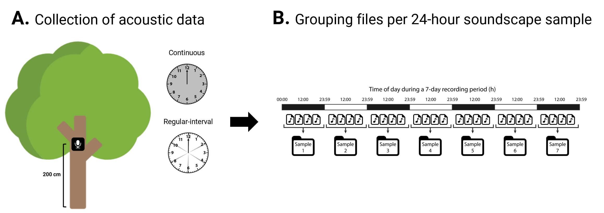
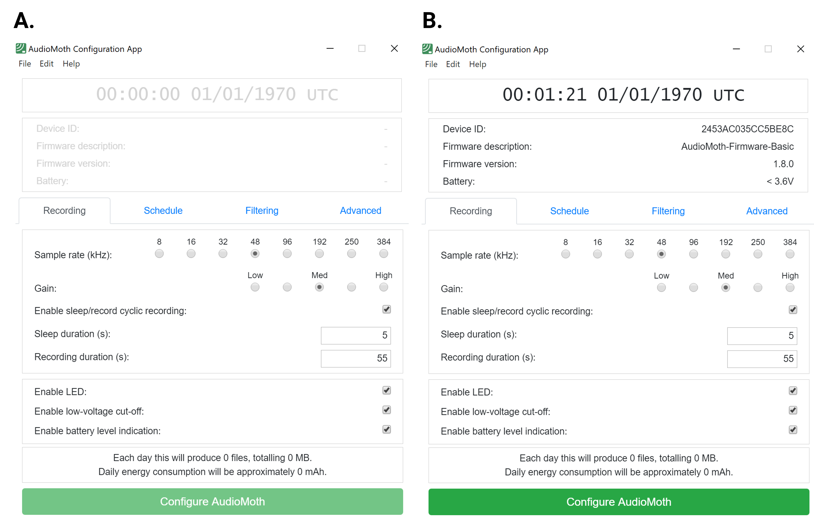
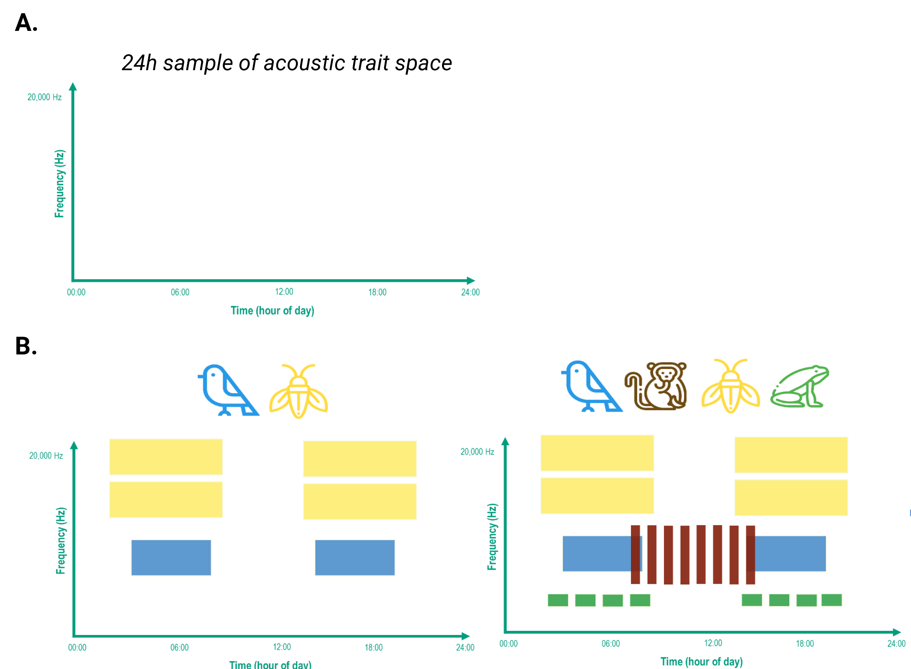
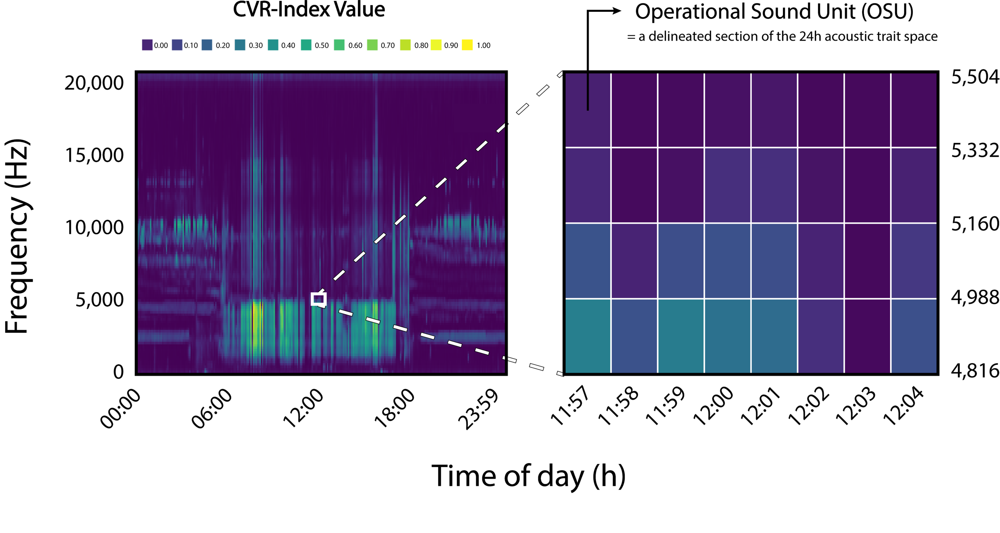
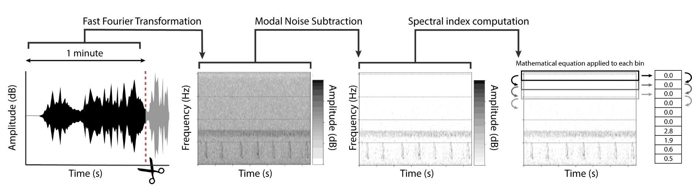
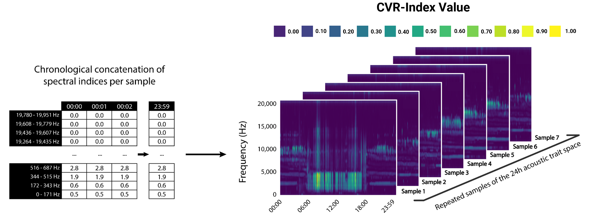
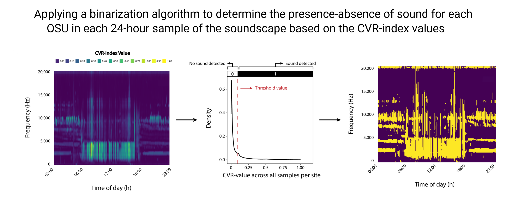
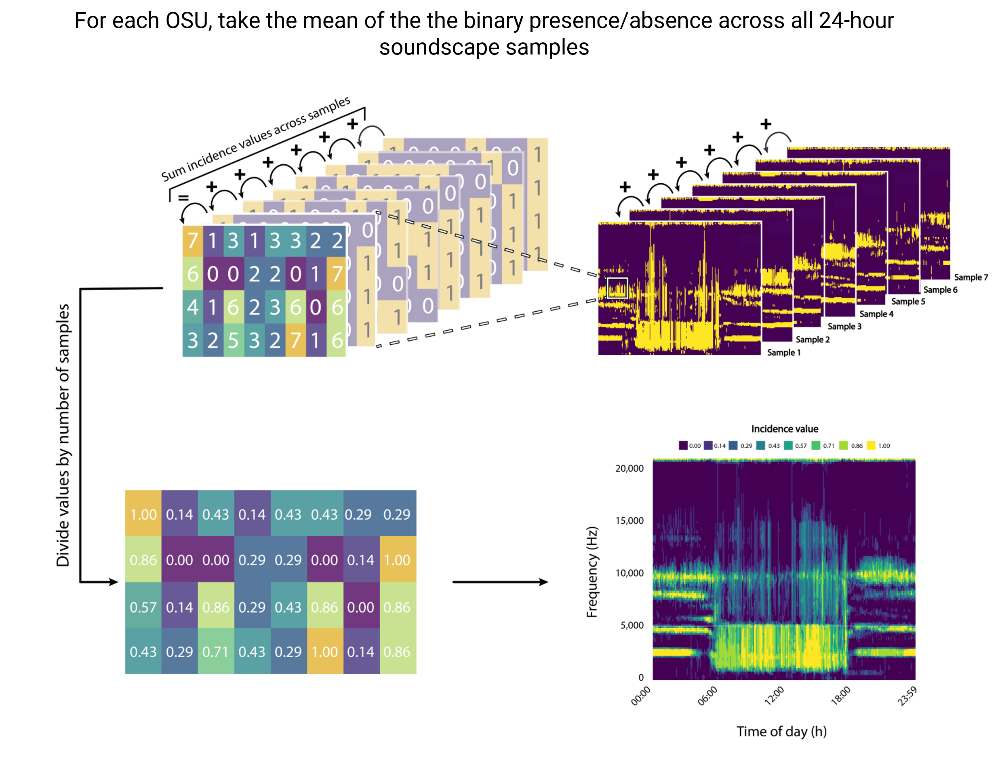

```{r setup, include=FALSE}
knitr::opts_chunk$set(echo = TRUE)

library(here)
library(learnr)
library(autothresholdr)
library(soundscapeR)

# The location of the sound files 


location_soundfiles <- paste0(base::system.file("extdata", 
                                                package = "soundscapeR",
                                                mustWork = TRUE), 
                              "/raw_sound_files")

location_output <- paste0(base::system.file("extdata",
                                            package = "soundscapeR",
                                            mustWork = TRUE),
                          "/processed_output_files")


output_location_1 <- paste0(location_output, "/256/G10_Coata_20151017_000000Z.wav/Towsey.Acoustic")

# Merge_csv on the raw sound files 

merged_soundscape <- merge_csv(fileloc = location_output,
                               samplerate = 44100,
                               window = 256, 
                               index = "CVR", 
                               date = "2015-10-17", 
                               lat = -1.648017, 
                               lon = -59.765621)


# Load the soundscape object included in the package 

location_soundscape_obj <- paste0(base::system.file("extdata", package = "soundscapeR", mustWork = TRUE), 
                              "/merged_soundscape")
merged_soundscape_CVR <- qs::qread(paste0(location_soundscape_obj, "/merged_soundscape_CVR.ssc"))

# Include only first 5 days of recording

merged_soundscape_CVR@merged_df <- merged_soundscape_CVR@merged_df[,1:1440]

# Binarized soundscape 
binarized_soundscape_CVR <- binarize_df(merged_soundscape = merged_soundscape_CVR,
                                        
                                    method = "IsoData")

# Aggregated soundscape

aggregated_soundscape_CVR <- aggregate_df(binarized_soundscape = binarized_soundscape_CVR, output = "incidence_freq")


```

## Welcome!

**Welcome to the `soundscapeR` tutorial!**

In this interactive RMarkdown document, we will teach you the basics or quantifying and visualizing the diversity of sound in large acoustic data using the `soundscapeR` R-package. This package is currently under development on [GitHub](https://github.com/ThomasLuypaert/soundscapeR), and the associated manuscript is in preparation. For a detailed overview of the analytical workflow, go have a look at the published paper [here](https://besjournals.onlinelibrary.wiley.com/doi/10.1111/2041-210X.13924). Moreover, head on over to this R-package's [vignette](https://github.com/ThomasLuypaert/soundscape) for a quick look at some background information, as well as some useful examples.


## Collecting acoustic data 

### Theory


Before assessing the soundscape diversity, acoustic data needs to be collected. For this, several decisions need to be made. 

First, the sampling rate and bit-depth of the acoustic recorder need to be chosen. These parameters will dictate the frequency and amplitude resolution respectively. The sampling rate should be twice the desired maximal frequency, a principle known as the [Nyquist-Shannon sampling theorem](https://www.techtarget.com/whatis/definition/Nyquist-Theorem). The choice of sampling rate and bit-depth constitutes a trade-off between the desired resolution on the one hand, and the available device storage and battery life on the other hand. This is because higher sampling rates and bit-depths are more storage- and energy-demanding. 

Next, the recording schedule and duration for each site should be decided. The workflow we present here makes use of eco-acoustic data, or acoustic recordings collected at large timescales (e.g. days, weeks, months or even years!). For soundscape studies, sound files are usually recorded for 1-minute durations (see [here](https://research.ecosounds.org/2019/08/09/analyzing-data-in-one-minute-chunks.html) why). Furthermore, the soundscape can be recorded either using a continuous (1440 minutes / day) or regular interval (*e.g.* 1 min / 5 min - or 288 minutes / day) sampling regime. However, it should be noted that sparse sampling regimes are generally discouraged for soundscape studies, as they require soundscapes to be recorded for long period of time before the soundcape variability is captured adequately, which in turn introduces issues related to seasonal variation. Ultimately, regardless of which acoustic survey sampling design is chosen, if multiple soundscapes are to be compared across a landscape, the same sampling design should be used. 


$$\\[0.1in]$$

```{r Fig_1, fig.align = 'centre', out.width = "100%", fig.cap = "", echo=FALSE}



```

$$\\[0.001in]$$
***Fig 1:*** *A theoretical representation of long-duration eco-acoustic data collection. Data is collected over a 7-day acoustic survey period using a continuous sampling regime. The sound files are grouped per 24-hour period and considered a sample of the soundscape.*

$$\\[0.1in]$$
<details><summary><b>To test your knowledge, click here</b></summary>
\


Let's see what you retained - have a go at the questions below, and try not to look up the answer above...

```{r question1, echo=FALSE}
question("Why is the Nyquist-Shannon sampling theorem relevant to acoustic data collection? \ This theory dictates that:",
  answer("the sampling rate should always be half the desired maximal recorded frequency."),
  answer("the sampling rate should always be twice the desired maximal recorded frequency", correct = TRUE),
  answer("you should always use a continuous sampling regime (1440 1-min files / day)"),
  answer("This theory is not relevant to acoustic data collection for soundscape studies")
)
```

```{r question2, echo=FALSE}
question("Which of the following statements is incorrect? \ Multiple answers are possible:",
  answer("Higher sampling rates/bit-depths are more storage and energy demanding"),
  answer("Sparse regular-interval sampling regimes are better for soundscapes because they capture the soundscape variability faster", correct = TRUE),
  answer("A continuous sampling regime produces 1440 1-minute sound files per day"),
  answer("When collecting soundscape data, using 1-hour sound files is the best option", correct = TRUE), 
  incorrect = "It seems like that was not a completely correct answer..."
)
```

</details>

### Choosing the right equipment

\
Now that we know the theoretical background required to collect acoustic data, we're ready to begin learning about the practical implementation. Let's get started!

**Before we can start recording the soundscape, we need:** 

  1. An acoustic recording device 
  2. A protective case 
  3. Three AA-batteries 
  4. A microSD card 
  

\

**1. Choosing the recording device**

The company [Open Acoustic Devices](https://www.openacousticdevices.info/) produces a number of acoustic loggers: the AudioMoth, the μMoth, and the HydroMoth. 

$$\\[0.1in]$$

```{r Fig_2, fig.align = 'centre', out.width = "100%", fig.cap = "", echo=FALSE}

knitr::include_graphics("images/PAM_devices.png")
```

$$\\[0.001in]$$
***Fig 2:*** *The various recording devices produces by Open Acoustic Devices: (i) AudioMoth; (ii) μMoth; (iii) HydroMoth.*

$$\\[0.1in]$$

AudioMoth is a low-cost, full-spectrum acoustic sound recording device. It can record both the audible and ultrasonic spectrum, reaching sampling rates up to 384 kHz. This means that, using AudioMoth, sounds up to 192 kHz can be recorded (remember the Nyquist-Shannon sampling theorem). The device records sounds in the uncompressed '.WAV' format. 

The μMoth is the world's smallest full-spectrum acoustic recording device, measuring just 25mm x 36mm and weighing 4 grams. It is the micro-sized version of the regular AudioMoth, and is capable at recording sound at sampling rates ranging between 8,000 - 384,000 samples/second (Hz). This tiny recording device opens up new avenues of acoustic monitoring, such as animal-bourne monitoring. 

Finally, the HydroMoth consist of an adapted case that houses the standard AudioMoth, but enables it to record underwater at depths up to 30-60m. 

These devices are significantly cheaper than other existing acoustic monitoring devices. For instance, AudioMoth costs 80 USD/device, whereas an equivalent SongMeter Mini costs 500 USD/device. For information on how to purchase *Open Acoustic Devices* products, visit [this](https://www.openacousticdevices.info/purchase) website. 

Since this analytical pipeline has been designed for terrestrial soundscape recordings, from here on out, we will focus on the use of AudioMoth. 

**2. Choosing a case**

Once we have our acoustic recording device, we need to find a way to protect it against the elements and wildlife.

If AudioMoths are to be deployed for short periods of time in mild conditions, enclosing the device in a light zip-lock back has been deemed to render sufficient protection. However, this is not a good option in more challenging terrestrial habitats. For instance, in many ecosystems, insects such as ants will create holes in the zip-lock bags, allowing water ingress. Moreover, in ecosystems with a lot of rain, this solution does not provide sufficient protection.

$$\\[0.1in]$$

```{r Fig_3, fig.align = 'centre', out.width = "100%", fig.cap = "", echo=FALSE}

knitr::include_graphics("images/PAM_case.png")

```

$$\\[0.001in]$$
***Fig 3:*** *The AudioMoth IPX7 Waterproof Case*

$$\\[0.1in]$$

In these more challenging field conditions, the easiest solution is to use AudioMoth's dedicated [IPX7 Waterproof Case](https://www.openacousticdevices.info/case). This case is very waterproof and rugged, allowing long acoustic surveys in challenging terrestrial environments. However, at 40 USD/case, this option is only suitable if sufficient budget is available. 

Finally, based on my own experience, [this](https://www.openacousticdevices.info/support/enclosures/case-for-audiomoth) home-made case for AudioMoth works very well, even in the most challenging of field conditions. The case consists of a [IP54 electric junction box](https://www.elektrika.lv/en/installation/installation-boxes/flush/obo-bettermann-junction-box-a8-a8-75x75x36-mm-ip55-with-lid-2000016) of 75mm x 75mm x 36mm. A small 5mm hole is drilled in the lid at the position where the AudioMoth microphone is positioned. This hole is then covered with a IP67 waterproof acoustic [membrane](https://voir.en.alibaba.com/product/60380452525-801219240/e_PTFE_acoustic_membrane_for_speaker_and_mic_IP67_waterproof_sticker.html). 


**3. Choosing batteries**

The AudioMoth device takes three AA-batteries. The type of battery determines the amount of energy available to the device, and thus, the potential recording duration before the AudioMoth runs out of energy. On average, good quality alkaline batteries have around 2600 mAh, which should be enough for standard AudioMoth deployments. However, for longer acoustic surveys at higher sampling rates (more energy demanding), Lithium batteries, which have approximately 3600 mAh, are recommended. 

$$\\[0.1in]$$

```{r Fig_4, fig.align = 'centre', out.width = "100%", fig.cap = "", echo=FALSE}


```

$$\\[0.001in]$$


We will see later on how we can calculate the potential recording duration based on the energy consumption and batteries. 
  
**4. Choosing SD-cards**

SD-cards come in many formats, varying in write speed, energy consumption, and the available storage on the card. 

$$\\[0.1in]$$

```{r Fig_5, fig.align = 'centre', out.width = "100%", fig.cap = "", echo=FALSE}


```

$$\\[0.001in]$$

The required write speeds will depends on which part of the frequency range you aim to record. The higher the recorded frequencies, the higher the sampling rate (how many times per second the sound is sampled) needs to be, and thus, the faster data needs to be written to the card. To make sure your microSD card works at all sampling rates, AudioMoth recommends using cards of UHS Speed Class 3 (U3). 

The energy consumption of an SD-card is relevant if the duration of the acoustic survey period is long, and batteries might run out of charge. This energy consumption can vary quite significantly between SD-card brands. Based on tests, the AudioMoth team recommends using cards of the brand *SanDisk Extreme*, as these consume the least energy.

Finally, with regard to the available data storage of the SD-card, this will depend on the storage requirements of planned study. We will see later on how we calculate the storage requirements and energy consumption using AudioMoth. 

</details>

### Setting up the equipment
\

Great, now that we've got an AudioMoth, a case, the right batteries, and a micro-SD card, we can start getting the device ready for deployment. 

**Let's get ready to set up the device:**

  1. Take the AudioMoth out of its case
  2. Insert three AA-batteries into the AudioMoth (mind the orientation - see below)
  3. Insert the micro-SD card into the AudioMoth (mind the orientation - see below)
  4. Slide the switch to CUSTOM
  
$$\\[0.1in]$$

```{r Fig_6, fig.align = 'centre', out.width = "100%", fig.cap = "", echo=FALSE}

knitr::include_graphics("images/PAM_equipment_insert.png")

```

$$\\[0.001in]$$
***Fig 6:*** *An illustration of how the batteries (A) and micro-SD card (B) are inserted into the AudioMoth.*

$$\\[0.1in]$$
If the device is new, and has never been configured before, both LEDs should start flashing. Great, this means we're finally ready to start configuring our device. Go ahead and slide the switch back to USB/OFF for now. 

### Configuring the device
\
The first thing we will do to configure the device with our desired acoustic survey settings, is download the *AudioMoth Configuration App* from the *Open Acoustic Devices* [website](https://www.openacousticdevices.info/applications). Once the app has been downloaded, go ahead and open it on your computer. 

$$\\[0.1in]$$

```{r Fig_7, fig.align = 'centre', out.width = "100%", fig.cap = "", echo=FALSE}




```

$$\\[0.001in]$$
***Fig 7:*** *The AudioMoth Configuration App when not connected (A) or connected (B) to an AudioMoth device.*

$$\\[0.1in]$$
As you can see in Fig. 7A, the time and date settings are currently still greyed out. This is because we have not yet connected our AudioMoth to the computer. Go ahead and connect the AudioMoth to the computer using a micro-USB cable. 

If you have successfully connected your AudioMoth to the computer, the greyed out area should turn black (Fig. 7B), and the date set to 01/01/1970. \
\
<details><summary><b>Help, the AudioMoth Configuration App doesn't recognize my device!</b></summary>
\

You have connected your AudioMoth to your computer, but the date and time in the AudioMoth Configuration App are not turning black! Don't worry, this happens all the time - it is likely one of the following issues:

  1. The cable you used does not allow transfer of data. Many micro-USB
  cables are intended for charging only, which might explain why your device
  was not recognized. It is pretty hard to tell data-transfer cables apart
  from charging cables, however,
  [this](https://www.dignited.com/50330/usb-data-cable-vs-usb-charging-cable/) website might provide some insight. Once you're sure the USB-cable is not the issue, move on to the next problem. 
  
  2. The switch on the AudioMoth is not in the USB/OFF position. This one is
  probably the easiest one to check. Check the switch on your device, and
  make sure it is in the correct position. If you've done this, but the
  device is still not recognized, move on to the next solution. 
  
  3. Your firmware you have on your AudioMoth device might be outdated. Your
  AudioMoth can be programmed with a newer version of the firmware using the
  [AudioMoth Flash App](https://www.openacousticdevices.info/applications).
  Go ahead and download the app to your computer, and open it. Connect your
  AudioMoth to the computer using a USB-cable with data transfer. If the
  firmware your device has is older than version 1.3.0, the flash app should
  recognize your AudioMoth. Download the latest version of the AudioMoth
  firmware, and flash your device. Wait for it to finish before your
  disconnect. If the current firmware on your device is older than version
  1.3.0, it will not support automatic switching to flash mode. This means
  that your device will not be immediately recognized by the app. Instead,
  in the Flash App, go to 'File' - 'Show manual switch instructions'. This
  will open up a window that guides you through the steps to set your
  AudioMoth into flash mode manually. You will need a metal paperclip to do
  this - make sure it is uncoated with plastic. If you've succeeded in
  flashing the AudioMoth's firmware to the latest version, try opening the
  AudioMoth Configuration App again to see if it recognizes the device. If
  it doesn't work, try closing the app and opening it again after flashing -
  and close out of the AudioMoth Flash App. 
  
  4. Did that still not work? Do not despair just yet. Does your computer
  run on Windows? You might have an issue with the driver that is installed
  in your computer to recognize the USB-device (AudioMoth). Disconnect your
  AudioMoth from the computer. Open up the Windows Device Manager. Scroll
  down to the 'Universal Serial Bus Controllers'. Now, connect your
  AudioMoth device to your computer. A new tab should show up called
  'Universal Serial Bus Devices', with a device inside called 'AudioMoth'.
  If this does not occur, there is probably an issue with the driver. Does a
  device show up in the 'Universal Serial Bus Controllers' tab? Does it have
  an issue (warning symbol) next to its name. Try opening that device by
  double clicking its name. A new window should open up. Head over to the
  'Driver' tab. You can try updating the driver by clicking the 'Update
  Driver' button. If this doesn't work, try removing the device. Now
  disconnect and reconnect your AudioMoth from the computer. The computer
  should try to install a new driver for this device. If everything went
  well, your AudioMoth should now appear in the 'Universal Serial Bus
  Devices' tab. 
  
\
  
None of these solutions worked? There is still a last option - head on over to the [AudioMoth Support Forum](https://www.openacousticdevices.info/support). There is a really good chance someone else has already encountered the same problem. If not, the maintainers of AudioMoth are pretty good at responding - so they can help you further problem solve your issue. Good luck!


</details>

\

Okay, so at this point, you've got the AudioMoth Configuration App in front of your, with your AudioMoth connected to the computer, and the data and time displayed in black? Excellent! We're ready to configure our device.

**Setting the date and time of your device:**

First things first! The date and time currently on your AudioMoth Configuration App are likely not correct (I'm guession you're in 1970 right now?). Right - let's change this. \
\
Setting the date and time of your device correctly is incredibly important - it is the only reference you will have to when sounds were produced in your analysis. Without a correct date-time reference for each file, your data is pretty useless. Just to say - pay attention to this part ;). \
\
The time of your AudioMoth device can be set in multiple time systems. By default, AudioMoth records the time at which files are recorded as the UTC - or Coordinated Universal Time. The UTC is equivalent to the GMT (Greenwich Mean Time) system, but does not consider the daylight saving some countries use. When you click the configure AudioMoth button in the next section, the date and time of your AudioMoth device will automatically take on the date and time in UTC. In addition to the UTC time format, the AudioMoth app also allows you to set the time of your device in 'local time'. To do this, click 'File' - 'Local Time' in the AudioMoth Configuration App. If you choose this option, the device will take on the data and time of your computer, including the time-zone you're in (even if you're not in the same time-zone as where the AudioMoths will be deployed). Be careful selecting which time system to use - make sure you're consistent, and know the time-zone where the AudioMoths will be deployed. For some advice on which system to use, take a look at [this](https://github.com/rhine3/audiomoth-guide/blob/master/guide.md) guide. 
\

Not that we have the heads-up regarding AudioMoth time management, let's select some settings for our acoustic survey:

**Select some settings:**

  1. **In the 'Recording' tab**
  
  + Set the sampling rate to 48 kHz \
    If you remember the Nyquist-Shannon sampling theorem, this means the
    upper frequency limit that will be recorded is 24 kHz. This is a little
    higher than the upper frequency audible to humans. An upper frequency
    limit of around 20 kHz is often used in soundscape studies.
  
  + Set the gain to *'Med'* \
    The *gain* is a term for the amount of amplification that is applied to
    the original acoustic signal when recorded, aimed at increasing its
    strength. Setting the optimal gain a bit of trail-and-error for your
    field conditions. If you set the gain too high, your sound files will
    suffer from [audio clipping](https://en.wikipedia.org/wiki/Clipping_(audio)), and your files
    will become impossible to analyse. Alternatively, if your gain
    is set too low, the sounds will be really faint in your recordings,
    which will also complicate analysis. For practical reasons, I tend to
    set the gain to *'Med'* when recording sound in forest environments. 
  
  + Set the recording schedule to record 1 min / 10 min \
    For this example, we will set our AudioMoth to record only 1 minute out
    of every 10 minutes. This is called a *regular-interval sampling regime*. We do this by setting the recording duration to 60 seconds (1
    minute), and the sleep duration to 540 seconds (9 minutes) - thus
    totalling 1 minute of recording per 10 minutes. 
    These non-continuous recording schedules are usually employed when there
    is a trade-off between the desired sampling duration or sampling rate
    (lead to high energy and storage requirements), and the available 
    battery life or SD-card storage. Reducing the number of sound files
    produced in a day can significantly increase the duration of the
    acoustic survey or the sampling rate, however, potentially introduces
    issues with capturing soundscape variability adequately (see theory
    section).  
    
  + We will leave the other settings as the default. 
    
  2. **In the 'Schedule' tab** \
  \
  For this workflow, we consider each 24-hour period of the acoustic survey
  a sample of the soundscape. As such, we want to make sure our AudioMoth is
  recording the whole day from 00:00 - 24:00. 
  
  3. **The 'Filtering' and 'Advanced' tabs** \
  \
  We will leave these two settings alone for our workshop, since they are not relevant to the type of data we wish to record for our pipeline. If you're interested in what these do, go have a look [here](https://www.openacousticdevices.info/config-app-guide). 

To see how to do this, have a look at [this](https://www.youtube.com/shorts/3hOsyPHKmH4) youtube video. 


\

Great, click the 'Configure AudioMoth' button. If everything went well, the date and time will turn grey for a brief moment, before turning black again. Good job, you've successfully configured your first AudioMoth device! Feel free to play around with the settings a little bit, so get a hang of the app. 

**Disconnecting your AudioMoth:** \
You can set the recording configuration of your AudioMoth without having the batteries inserted. If the firmware on your device is more recent than version 1.5.0, the device will remember the configuration settings after the power is lost. However, the time information will be lost when the AudioMoth is disconnected without having batteries inside to supply power. Yet, sometimes, we wish to transport our AudioMoths to the field without batteries inside. So, how to we set the time correctly then? Configuring your AudioMoth using your computer in the field is an option, but not the most practical one. Instead, you can download the [AudioMoth Mobile Application](https://www.openacousticdevices.info/mobileapplications). When you're in the field, make sure your AudioMoth does not have batteries. Slide with switch of the AudioMoth to CUSTOM. Now, insert the batteries. The AudioMoth will now be listening to hear a *chime* - a little melody produced by the *AudioMoth Mobile App*. This chime contains time information, and is used to set the time in the field. 

**Testing your settings before heading into the field:**

Before relying on everything working perfectly with the AudioMoth Configuration and time-setting using the *AudioMoth Mobile App* chime, we want to remind you that **testing your settings is crucial**. Configure your AudioMoth, disconnect it from your computer, remove the batteries. Now, slide the switch to custom, re-insert the batteries (and make sure the SD-card is also inserted). Play the acoustic chime from your mobile app. Now, pull the switch back into the USB/OFF position. Finally, slide the switch back into CUSTOM. The AudioMoth should now be recording based on the schedule you selected. Let the device record for a few minutes. Then, slide the switch back to USB/OFF, remove the SD-card and take a look at the files that were produced. Make sure the sampling regime is correct, and the date and time were correctly recorded in the file names. \
\
If everything went well, save your configuration by clicking 'File' - 'Save Configuration' in the *AudioMoth Configuration App*. When configuring the rest of your AudioMoths in the acoustic survey, you can use this file to make sure all devices have the same settings. 

**How long can I record for before I run out of memory/battery life?** \
\
As promised, I would tell you how you can calculate the battery life and storage requirements of your AudioMoth once you've selected the settings. In the *AudioMoth Configuration App*, once you've selected the settings you want, the daily energy consumption and memory usage will be displayed. \
\
To determine how many days you have storage for, simply divide the size of your micro-SD card (*e.g.* 64 GB) by the daily storage requirements in GB (*e.g.* ). For instance, using the settings above, the AudioMoth would need 0.83 GB/day. If I had a 64 GB micro-SD card, I would be able to record sound for 77 days before running out of memory (64/0.83). \
\
To determine how long you have before your batteries run out, simply divide the capacity of a single battery (*e.g.* 3600 mAh for Lithium batteries) by the daily energy requirement. For instance, for the settings above, I need 32 mAh/day. If I had three Lithium AA-batteries with a capacity of 3600 mAh, I would be able to record for 112 days before the batteries run out of energy. \
\
Considering these two calculations, I can record for a minimum of 77 days, limited by the storage on the SD-card. By using larger SD-cards, I could record for even longer - however this is not necessary for most soundscape studies. You can try [this](https://trinket.io/python/ff8aeb66e1) little software tool to calculate your storage and battery life using the settings you selected in the *AudioMoth Configuration App* to select the optimal sampling design for your study. 

**Summary**

Up to this point, we've learned how acoustic data is recorded, what *theoretical* factors we need to consider, what *practical* aspects we need to consider, how we configure our AudioMoth device, and more. Finally, we're ready to deploy our acoustic sensors in the field!

### Deploying your device in the field


**Test your knowledge**


We're off to a good start! If you didn't get the all answers correct, do not worry - go take a look at the `soundscapeR` vignette or the theory in this tutorial, and try again. 

Now that we know how to collect the data, we will learn how to process it using the workflow...

## The workflow

### 1. A note on quantifying biological diversity
\
In biodiversity research, the diversity of ecological communities is usually quantified by taking **samples** of the natural environment, delineating **individuals** within a sample, classifying them into **groups** with **shared features**, and finally, attributing an **importance value** to each group. In community ecology, for example, for each biological sample, individuals are traditionally classified into taxonomic species (groups) based on shared morphological features, and the number of individuals per group is counted per sample (abundance - importance value). Yet, using this workflow, we wish to quantify the diversity of sounds emanating from the landscape without a taxonomic link to the source organisms, hereafter referred to as the *soundscape diversity*. \
\
**Hence, to quantify this *soundscape diversity*, we require several new concepts:** \

  1. **Samples** of the soundscape \
  2. **Individuals** \
  3. **Shared features** - used to produce 
  4. **Groups** \
  5. **Importance values** per group\
\

#### 1.1. Defining a soundscape sample 
\
Species can produce sound in a two-dimensional space, delineated by the *frequency domain* on the one hand, and the *temporal domain* on the other hand. This *acoustic trait space* can be seen as a core ecological resource for which sonically sympatric species compete. To avoid overlap in their vocalizations, which would lead to ineffective communication, species are theorized to partition their acoustic niche in the time-frequency domain. Therefore, a more species-rich community should lead to increased competition and partitioning of the acoustic niche, which is reflected in the diversity of sounds in the acoustic trait space. In this way, by sampling the diversity of sound in the acoustic trait space, we can try to make inference about the taxonomic diversity of the underlying sound-producing community. \
\
As such, to quantify the soundscape diversity, we need to sample the acoustic trait space. To do this, we need to decide which parts of the time-frequency domain we will sample. Although soniferous species produce sounds from infrasound to ultrasound, for this workflow, we recommend constraining the frequency domain of the acoustic trait space to 22,050 Hz, approximately the maximal frequency audible to humans. We employ this strategy for two reasons. First, most wildlife sounds can be found in this frequency range, so the evolutionary mechanisms structuring acoustic assemblages are likely strongest in this range. Second, in downstream analyses, we use a spectral acoustic index to capture the acoustic features of sounds, and ultrasonic frequencies are usually omitted from such indices. \
\
In the temporal domain, we follow [Aide et al. (2017)](https://www.mdpi.com/2072-4292/9/11/1096) and consider 24h an appropriate temporal sample of the acoustic trait. The reasoning here is twofold. First, we are interested in investigating the presence of all sounds produced at a given site for a particular time of year, not just sounds at a particular time of day. Second, almost all living organisms have circadian rhythms in sound emission, and thus, some of the temporal partitioning of acoustic niches likely occurs in the 24-hour time domain. Therefore, we deem 24h a suitable temporal sample duration. \
$$\\[0.1in]$$


```{r Fig_8, fig.align = 'center', out.width = "100%", fig.cap = "", echo=FALSE}



```
$$\\[0.001in]$$
***Fig 8:*** *A conceptual visualization of the acoustic trait space in which species can produce sound.* ***A.*** *A 24h sample of the acoustic trait space, delineated by the frequency domain (0 - 22,050 Hz) and temporal domain (00:00h - 24:00h). We will use this as our sample of the soundscape, and sample it repeatedly over the course of the acoustic survey (multiple days).* ***B.*** *A visual representation of how more species-rich sound-producing community can lead to a higher diversity of sound in the 24h acoustic trait space.*

$$\\[0.1in]$$
\

#### 1.2. Grouping individuals by shared properties 
\
For our workflow, we have renounced the identification of individual vocalizations from sound files. As such, we do not want to work with *individuals* in the traditional sense. Instead, per 24h sample of the acoustic trait space, we wish to group *sounds* emanating from the landscape by their shared acoustic features. \
\
In analogy to Operational Taxonomic Units (OTUs) used in genetic research, we propose the **Operational Sound Unit (OSU)**, an entity that groups sounds by their shared acoustic properties in the time-frequency domain, and use this to assess soundscape diversity. OSUs are obtained by subdividing the 24h acoustic trait space into many discrete spectro-temporal bins which are the soundscape equivalent of the time-frequency bins in a spectrogram. Each OSU delineates a unique section of the 24h acoustic trait space, and thus, has unique time-frequency properties which can be used to group sounds. \
\
In sections 2 and 3, you will see how we will use *spectral acoustic indices* to assess the presence/absence of sounds per 24h sample of the acoustic trait space, and group sounds into OSUs by their shared acoustic features. 
  
  


$$\\[0.1in]$$


```{r Fig_9, fig.align = 'center', out.width = "100%", fig.cap = "", echo=FALSE}



```
$$\\[0.001in]$$
***Fig 9:*** *A conceptual visualization of Operational Sound Units (OSUs) in the 24-hour acoustic trait space. Each 24-hour sample of the acoustic trait space can be divided into sections which we define as OSUs. These OSUs are delineated by the frequency-bin width of the spectral index vector (frequency domain) and the recording interval of the sampling regime (temporal domain), and groups sounds by their shared properties in acoustic trait space.*

$$\\[0.1in]$$

### 2. Calculating acoustic indices

### 2.1. Theory {data-progressive=FALSE}
\
For the first step in our workflow, we will make use of ***spectral acoustic indices*** to capture the acoustic properties of sound in our 1-minute recordings. Doing so, we greatly condense the amount of information contained in these sound files while retaining important data on their time-frequency features. For more information on spectral acoustic indices are their use, check out [this](https://research.ecosounds.org/research/eadm-towsey/long-duration-audio-recordings-of-the-environment) website. To calculate these spectral indices, we will use the `index_calc()` function. This function calls on the 'AnalysisPrograms' software tool, developed by the QUT Ecoacoustic group, to compute a series of spectral acoustic indices. 

In case the duration of each sound file is longer than 1 minute, the function cuts the files into 1-minute segments. Next, the sound files will be converted from relatively uninformative amplitude-over-time format to the much more informative amplitude time-frequency format (a spectrogram). To do this, the function uses a ***Fast Fourier Transformation*** (FFT - check out this [excellent video](https://www.youtube.com/watch?v=spUNpyF58BY) if you want to learn more about the FFT). For the FFT, two parameters need to be chosen: (i) the window length; (ii) the sampling rate. As we mentioned in in earlier parts of this tutorial, the sampling rate is chosen during acoustic data collection and should we twice the desired maximal frequency. The window length is typically a power of 2, and dictates the resolution of time-frequency bins in the spectrogram that is produced by the FFT: 

  1. The temporal resolution (TR) is given by: TR = window length / 2. 
  2. The frequency resolution (FR) is given by: FR = sampling rate / window length. 

The temporal and frequency resolution are inversely correlated - the higher the frequency resolution, the lower the temporal resolution, and vice-versa. For more information on the choice of window length in the context of our workflow, consult [Luypaert et al. (2022)](https://www.biorxiv.org/content/10.1101/2022.01.11.475919v1). 

Finally, the function performs a noise-reduction step to each spectrogram (see [here](https://eprints.qut.edu.au/110634/1/QUTePrints110634_TechReport_Towsey2017August_AcousticIndices%20v3.pdf)) and applies a mathematical equation (acoustic index) to each noise-reduced frequency bin to produce a vector of spectral index values (Fig. 9). 


$$\\[0.1in]$$

```{r Fig_10, fig.align = 'center', out.width = "100%", fig.cap = "", echo=FALSE}



```
$$\\[0.001in]$$
***Fig 10:*** *A theoretical representation of how spectral indices are computed. First, each 1-minute sound file is subjected to a Fast Fourier Transformation, which extracts information on the amplitude variation across the time-frequency domain. Next, the resulting spectrogram is subjected to a noise-removal step. Finally, a mathematical equation (spectral index) is applied to the amplitude values in each frequency bin, resulting in a spectral index vector with one index value per frequency bin.*

$$\\[0.1in]$$

### 2.2. In practice 
\
For the purposes of this tutorial, a few raw sound files are provided in the package data. These sound files were collected at the Balbina Hydroelectric Reservoir in Brazilian Amazonia using a 1 min / 5 min sampling regime and a 44,100 Hz sampling rate.\
 \
**Let’s take a look at where the raw data is saved on your device:** 
 \
```{r global_setup, include=FALSE}
library(soundscapeR)

learnr::tutorial_options(exercise.timelimit = 180)

location_soundfiles <- paste0(base::system.file("extdata", 
                                                package = "soundscapeR",
                                                mustWork = TRUE), 
                              "/raw_sound_files")

location_output <- paste0(base::system.file("extdata", 
                                            package = "soundscapeR",
                                            mustWork = TRUE), 
                          "/processed_output_files")

```

```{r fileloc, exercise = TRUE}


location_soundfiles <- paste0(base::system.file("extdata", 
                                                package = "soundscapeR",
                                                mustWork = TRUE), 
                              "/raw_sound_files")

print(location_soundfiles)

```
\
**Perfect, now that we know where the test files are stored, let's see what files there are:** 
\

```{r file_id, exercise = TRUE}
list.files(location_soundfiles)
```
\
Look at that! The package contains 12 sound files collected on the 17th of October 2015, between midnight and 1 AM (00:00 - 00:55) using a 1 min / 5 min sampling regime, as previously mentioned. Next, we will use this sample data to demonstrate how acoustic indices are calculated using the `index_calc` function. \
 \

**To see how the `index_calc` function works, we can consult the package documentation:** \
 \

```{r index_calc_doc, exercise = TRUE, exercise.setup = "global_setup"}
?soundscapeR::index_calc
```

This opens up the package documentation in your default browser. Based on the package documentation, this function can take five arguments: 

  1. **fileloc**: \
  The full-length path to the sound file for which to compute indices. 
  2. **outputloc**: \
  The full-length path to the location where you wish to save the output files. Defaults to the same location as the fileloc.
  3. **samplerate**: \
  The number of times the sound was sampled each second. This is a fixed parameter determined by your recording setup, although downsampling to a lower sampling rate is possible.
  4. **window**: \
  A variable of the Short-time Fourier Transformation, expressed as the number of samples. The window size of choice depends on the fundamental frequency, intensity and change of the signal of interest, and influences the temporal and frequency resolution of the analysis. The window size is generally a power of 2.
  5. **parallel**: \
  A boolean flag (TRUE of FALSE) indicating whether parallel processing should be enables for index computation. Set to FALSE by default. \
\

**Let's create a folder where the output of the acoustic index computation will be saved:** \
\

```{r outputloc, exercise = TRUE}

location_output <- dir.create(
  paste0(base::system.file("extdata", 
                           package = "soundscapeR",
                           mustWork = TRUE), 
         "/processed_output_files"))

```


 \
 
**Exercise 1: Use the `index_calc` function on the sample data** \
\
Try to calculate the acoustic indices using a window length of 256 frames with parallel processing, and save the output files in the location we specified above. Can you figure out what the code should be? The `soundscapeR` R-package is already loaded. \
\
```{r index_calc, exercise = TRUE, exercise.setup = "global_setup", exercise.timelimit = 500, results='hide', warning=FALSE, comment=FALSE}
# Write the code to calculate acoustic indices for the sound files included in the package data using a 256 window length, with parallel computing, and saving the files in their default location


```

```{r index_calc-hint-1}
# We already made an object containing the path to the location where the sound files are located - consider using this in the function. Try:

index_calc(fileloc = location_soundfiles)
```

```{r index_calc-hint-2}
# To save the output to a custom location, use the outputloc argument. We specified where we would like to save the output files earlier... Try:

index_calc(fileloc = location_soundfiles, 
           outputloc = location_output)
```

```{r index_calc-hint-3}
# We mentioned the sampling rate with which the acoustic data was collected earlier. Scroll up to take a look, and add it to the function. Try:

index_calc(fileloc = location_soundfiles,
           outputloc = location_output,
           samplerate = 44100)
```

```{r index_calc-hint-4}
# We asked you to use a window length of 256 frames. Try:

index_calc(fileloc = location_soundfiles, 
           outputloc = location_output,
           samplerate = 44100, 
           window = 256)
```

```{r index_calc-hint-5}
# The 'parallel' parameter takes boolean operators ('TRUE' or 'FALSE'). If we want to turn on parallel computing, which one should we specify? Try

index_calc(fileloc = location_soundfiles, 
           outputloc = location_output,
           samplerate = 44100, 
           window = 256, 
           parallel = TRUE)
```

```{r index_calc-solution}

# Full solution:

index_calc(fileloc = location_soundfiles,
           outputloc = location_output,
           samplerate = 44100, 
           window = 256, 
           parallel = TRUE)


```
\
Awesome, first step completed! Note that, with long-duration eco-acoustic data, this step can take a while. To speed up the process, you can set parallel = TRUE.

**Now, let’s take a look at which indices we’ve computed for one of the sound files:** \
\
```{r soundloc, exercise = TRUE, exercise.setup = "global_setup"}

# Get the location where the output of the first sound file is saved

output_location_1 <- paste0(location_output, "/256/G10_Coata_20151017_000000Z.wav/Towsey.Acoustic")

# Grab the files containing acoustic index output

list.files(output_location_1)[grep(pattern = ".csv",
                                   x = list.files(output_location_1))][-7]
#>  [1] "G10_Coata_20151017_000000Z__Towsey.Acoustic.ACI.csv"
#>  [2] "G10_Coata_20151017_000000Z__Towsey.Acoustic.BGN.csv"
#>  [3] "G10_Coata_20151017_000000Z__Towsey.Acoustic.CVR.csv"
#>  [4] "G10_Coata_20151017_000000Z__Towsey.Acoustic.DIF.csv"
#>  [5] "G10_Coata_20151017_000000Z__Towsey.Acoustic.ENT.csv"
#>  [6] "G10_Coata_20151017_000000Z__Towsey.Acoustic.EVN.csv"
#>  [7] "G10_Coata_20151017_000000Z__Towsey.Acoustic.OSC.csv"
#>  [8] "G10_Coata_20151017_000000Z__Towsey.Acoustic.PMN.csv"
#>  [9] "G10_Coata_20151017_000000Z__Towsey.Acoustic.RHZ.csv"
#> [10] "G10_Coata_20151017_000000Z__Towsey.Acoustic.RNG.csv"
#> [11] "G10_Coata_20151017_000000Z__Towsey.Acoustic.RPS.csv"
#> [12] "G10_Coata_20151017_000000Z__Towsey.Acoustic.RVT.csv"
#> [13] "G10_Coata_20151017_000000Z__Towsey.Acoustic.SPT.csv"
#> [14] "G10_Coata_20151017_000000Z__Towsey.Acoustic.SUM.csv"


```
\
Great, using the simple `index_calc` command, we've computed 14 spectral acoustic indices, each of which a captures different aspect of the acoustic structure of sound files. For an overview of the different indices, please consult the \code{\link[soundscapeR]{index_calc}} documentation, the QUT AnalysisPrograms Tutorial [website](https://ap.qut.ecoacoustics.info/tutorials/01-usingap/practical?tabs=windows), or the Towsey (2017) technical [report](https://eprints.qut.edu.au/110634/1/QUTePrints110634_TechReport_Towsey2017August_AcousticIndices%20v3.pdf). 

For the rest of this tutorial, following [Luypaert et al. (2022)](https://www.biorxiv.org/content/10.1101/2022.01.11.475919v1), we will be using the **Acoustic Cover Index (CVR)** to capture the acoustic features of our recorded sounds. Per sound file, this index captures the fraction of cells in each noise-reduced frequency bin whose value exceeds a 3 dB threshold. 

### 3. Merging the spectral index values chronologically

Next up, the CVR-index vectors for all 1-minute files for the acoustic survey at a site are concatenated chronologically, creating a data frame with the time of recording as columns, the frequency bins as rows, and the value of the CVR index for each time-frequency bin as cells. This reveals the presence and distribution of sound in each sample of the 24-hour acoustic trait space (Fig. 10). 


$$\\[0.1in]$$

```{r Fig_11, fig.align = 'center', out.width = "100%", fig.cap = "", echo=FALSE}




```
$$\\[0.001in]$$
***Fig 11:*** *A theoretical representation of the chronological concatenation step. All the spectral index vectors resulting from the index computation at a site are merged chronologically, resulting in a time-by-frequency data frame containing the spectral index values. On the right, a visual representation of the spectral index values in the time-by-frequency data frame for seven 24-hour samples of the acoustic trait space.*

$$\\[0.1in]$$

#### The `merge_csv` function
\
To do this, we can use the `merge_csv` function. 
\

**Let's see how the `merge_csv` function works, by consulting the package documentation:** \
 \

```{r merge_csv_doc, exercise = TRUE, exercise.setup = "global_setup"}
?soundscapeR::merge_csv
```

Based on the package documentation, this function can take seven arguments: 

  1. **fileloc**: \
  The full-length path to the location where the output directory of the index_calc function are saved
  2. **samplerate**: \
  The sampling rate specified in the `index_calc` function.
  3. **window**: \
  The window length specified in the `index_calc` function.
  4. **index**: \
  The acoustic index of interest. Options are "BGN", "PMN", "CVR", "EVN", "ENT", "ACI", "OSC", "SPT", "RHZ", "RVT", "RPS" and "RNG". \
  5. **date**: \
The first day of the recording period. Used for managing time-objects in R. Formatted as "YYYY-mm-dd". \
  6. **lat**: \
  The latitude of the site at which the sound files were collected. Coordinates should be specified in decimal degrees as a numerical variable.\
  7. **lon**: \
  The longitude of the site at which the sound files were collected. Coordinates should be specified in decimal degrees as a numerical variable.
\
\

**Exercise 2: Merge the CVR-index values for the sample sound files using the `merge_csv` function**

Try to merge the CVR-index files we calculated in exercise 1 using the `merge_csv` function. Save the output of this function to an object in the R Environment called 'merged_soundscape'. As mentioned before, for this worflow, we're only interested in the CVR-index. The data was collected on the 17th of October 2015, at a latitude of -1.648017 and a longitude of -59.765621. Can you figure out what the code should be? The `soundscapeR` R-package is already loaded. \
\

```{r merge_csv_setup, include=FALSE}

library(soundscapeR)

learnr::tutorial_options(exercise.timelimit = 180)

location_soundfiles <- paste0(base::system.file("extdata", 
                                                package = "soundscapeR",
                                                mustWork = TRUE), 
                              "/raw_sound_files")

location_output <- paste0(base::system.file("extdata", 
                                            package = "soundscapeR",
                                            mustWork = TRUE), 
                          "/processed_output_files")

merged_soundscape <- merge_csv(fileloc = location_output,
                               samplerate = 44100,
                               window = 256, 
                               index = "CVR", 
                               date = "2015-10-17", 
                               lat = -1.648017, 
                               lon = -59.765621)


```

```{r merge_csv, exercise = TRUE, exercise.setup = "global_setup", exercise.timelimit = 500, results='hide', warning=FALSE, comment=FALSE}
# Write the code to merge the CVR-index files we calculated in exercise 1


```


```{r merge_csv-hint-1}
# We need to start by specifying the name of the object to which we will save the output of the 'merge_csv' function in the R Environment. Try:

merged_soundscape <- merge_csv()

```


```{r merge_csv-hint-2}
# We already made an object containing the path to the location where the output CVR-index files are located - consider using this in the function. Try:

merged_soundscape <- merge_csv(fileloc = location_output)

```

```{r merge_csv-hint-3}
# We already specified the sample rate and window length in the previous exercise. Try:

merged_soundscape <- merge_csv(fileloc = location_output, 
                               samplerate = 44100, 
                               window = 256)
```

```{r merge_csv-hint-4}
# We only need one type of spectral acoustic index for this workflow: the CVR-index. Specify this for the index argument. 

merged_soundscape <- merge_csv(fileloc = location_output, 
                               samplerate = 44100, 
                               window = 256, 
                               index = "CVR")
```

```{r merge_csv-hint-5}
# We supplied the data at which the data was collected in the explanation of exercise two. Make sure to follow the required format listed in the package documentation of the 'merge_csv' function. Try:

merged_soundscape <- merge_csv(fileloc = location_output, 
                               samplerate = 44100,
                               window = 256, 
                               index = "CVR",
                               date = "2015-10-17")
```

```{r merge_csv-hint-6}
# The latitude and longitude coordinates were mentioned in the explanation of exercise 2. Try using these in the function:

merged_soundscape <- merge_csv(fileloc = location_output, 
                               samplerate = 44100, 
                               window = 256, 
                               index = "CVR", 
                               date = "2015-10-17", 
                               lat = -1.648017, 
                               lon = -59.765621)
```

```{r merge_csv-solution}

# Full solution:

merged_soundscape <- merge_csv(fileloc = location_output,
                               samplerate = 44100,
                               window = 256, 
                               index = "CVR", 
                               date = "2015-10-17", 
                               lat = -1.648017, 
                               lon = -59.765621)


```

Good work! \
\


#### Introducing the *soundscape* object

As you may have noticed, this function requires us to provide some additional background information regarding how the data was collected and processed. This is because, using the `merge_csv` function, we are creating a new type of data object which stores all the relevant information for that acoustic data collection! As we continue to go through the workflow, the data object will continue to be updated, and will form the basis of all subsequent functions. \
\
**Let's take a look at this newly created object:**

```{r soundscape_inspection_1, exercise = TRUE, exercise.setup = "merge_csv_setup", exercise.timelimit = 500}
# Let's see what class this object is:
summary(merged_soundscape)
```

This new data object is an 'S4' object of the class *soundscape*.\
\

**Let's see what sort of information this object holds:**

```{r soundscape_inspection_2, exercise = TRUE, exercise.setup = "merge_csv_setup", exercise.timelimit = 500}
# Let's see what sort of information this object holds
merged_soundscape
```

As we can see, this objects holds two types of information: 

  1. Metadata information regarding the data collection and processing steps
  2. Soundscape information, which will continue to be updated as we move throughout our analytical pipeline. \
  \
To access the information stored in this object, we will use the '@' symbol. \
\

**Let's take a look at which types of data are stored in the object so far:**

```{r soundscape_inspection_3, exercise = TRUE, exercise.setup = "merge_csv_setup", exercise.timelimit = 500}
# Let's check what sort of data collection metadata is stored in the object
print(paste0("First day of data collection: ", merged_soundscape@first_day))
print(paste0("Latitude at data collection site: ", merged_soundscape@lat))
print(paste0("Longitude at data collection site: ", merged_soundscape@lon))
print(paste0("Time zone at data collection site: ", merged_soundscape@tz))
print(paste0("Sunrise at time of data collection: ", merged_soundscape@sunrise))
print(paste0("Sunset at time of data collection: ", merged_soundscape@sunset))
```

The `merge_csv` function has automatically calculated a set of important ecological information regarding the place and time of year at which the data was collected, such as sunrise and sunset times, timezones, and location coordinates. \
\

**Let's continue looking at the data stored in the** ***soundscape*** **object:**

```{r soundscape_inspection_4, exercise = TRUE, exercise.setup = "merge_csv_setup", exercise.timelimit = 500}
# Let's check what sort of metadata the object has stored regarding past data processing steps
print(paste0("Where are the raw sound files located: ", merged_soundscape@fileloc))
print(paste0("What acoustic index are we using: ", merged_soundscape@index, " index"))
print(paste0("What was the samplerate used to collect the data: ", merged_soundscape@samplerate, " Hz"))
print(paste0("What was the window length used during the FFT: ", merged_soundscape@window, " samples"))
```

The *soundscape* object has recorded where our raw data files are stored, which acoustic index we're working with, what sampling rate was used during data collection, and which window length was used during the acoustic index calculation. \
\

**Finally, let's take a look at the structure of the data frame we obtained by merging the CVR-index files chronologically:**

```{r soundscape_inspection_5, exercise = TRUE, exercise.setup = "merge_csv_setup", exercise.timelimit = 500}
head(merged_soundscape@merged_df)[,1:5]
```

As we previously mentioned, this data frame contains the spectral CVR-index files we calculated, and concatenated them chronologically, resulting in the time-of-recording as column names, the frequency bins as row names, and the CVR-index for each time-frequency pair as values. Each column contains the spectral index values of a single sound file. \
\

**Let's inspect this data frame a little closer:**

```{r soundscape_inspection_6, exercise = TRUE, exercise.setup = "merge_csv_setup", exercise.timelimit = 500}
# How many columns does the data frame contain?
paste0("The data frame contains: ", ncol(merged_soundscape@merged_df), " columns")
# What are the column names?
colnames(merged_soundscape@merged_df)
```

As we said, the number of columns equals the number of sound files collected during the acoustic survey - in this case, the 12 files contained in the package's sample data. The name of each column correponds to the time of day at which the recording was collected. \
\

**Next, let's take a look at the rows:**

```{r soundscape_inspection_7, exercise = TRUE, exercise.setup = "merge_csv_setup", exercise.timelimit = 500}
# How many rows does the data frame contain?
paste0("The data frame contains: ", nrow(merged_soundscape@merged_df), " rows")
# What do these row names look like?
  # The first five names
paste0("The first five rownames: ", paste0(rownames(merged_soundscape@merged_df)[1:5], collapse = ", "))
  # The last five names
paste0("The last five rownames: ", paste0(rownames(merged_soundscape@merged_df)[123:128], collapse = ", "))
```

The data frame contains 128 rows, each corresponding to a unique frequency bin. The frequency bins range from 0 - 22,050 Hz, and are of approximately 172 Hz width. \
\

**Now, let's inspect the CVR-index values:**

```{r soundscape_inspection_8, exercise = TRUE, exercise.setup = "merge_csv_setup", exercise.timelimit = 500}
# What is the minimum CVR-index value in our data frame?
paste0("The minimum CVR-value in our data frame is: ", min(merged_soundscape@merged_df))
# What is the maximum CVR-index value in our data frame?
paste0("The max CVR-value in our data frame is: ", max(merged_soundscape@merged_df))
```

As we can see, in our dataset, the CVR-index values range between 0 - 0.50. Remember, CVR-index values capture the proportion of cells in each noise-reduced frequency bin of a sound file that exceeds a 3-dB amplitude threshold. As such, the values can technically range between 0 and 1. \
\

#### Loading some real eco-acoustic data

\
For the rest of the workflow, instead of using the limited data produced by the raw sound files available in the package, we will be using a *soundscape* object created by CVR-index computation and chronological concatenation of real-life long-duration eco-acoustic data. This data was collected at the Balbina Hydroelectric Reservoir in Brazilian Amazonia, using a 44,100 Hz sampling rate and a 1 min / 5 min sampling regime for 5 days. The CVR-index was calculated using a 256-frame window during the Fast Fourier Transformation. 

**This object is available in the package, and can be loaded as follows:** \
\
```{r merged_soundscape_CVR_1, exercise = TRUE, exercise.setup = "merge_csv_setup", exercise.timelimit = 500}

location_soundscape_obj <- paste0(base::system.file("extdata", package = "soundscapeR", mustWork = TRUE), 
                              "/tutorial")
merged_soundscape_CVR <- qs::qread(paste0(location_soundscape_obj, "/Garrafa.ssc"))

# Include only first 5 days of recording
merged_soundscape_CVR@merged_df <- merged_soundscape_CVR@merged_df[,1:1440]

print("DONE")

```
\
**Let's inspect what this** ***soundscape*** **object looks like:** \
\
```{r merged_soundscape_CVR_inspection_1, exercise = TRUE, exercise.setup = "merge_csv_setup", exercise.timelimit = 500}

merged_soundscape_CVR

```
\
The data was collected on the 5th of September 2015 in the time zone of Manaus of Brazil, using a sampling rate of 44,100 Hz. The *soundscape* object contains the *'merged_df'* resulting from the `merge_csv` function for the CVR-index, which was calculated using a 256 frame window length. \
\
**Let's take a look at the dimensions of the** ***'merged_df'*** **data frame:** \
\
```{r merged_soundscape_CVR_inspection_2, exercise = TRUE, exercise.setup = "merge_csv_setup", exercise.timelimit = 500}

# How many rows does the data frame have?

paste0("The merged_df data frame has ",
       nrow(merged_soundscape_CVR@merged_df),
       " rows.")


# How many columns does the data frame have?

paste0("The merged_df data frame has ",
       ncol(merged_soundscape_CVR@merged_df),
       " columns")

```
\
The data frame has 128 rows and 1440 columns. Each of the 128 rows represents a frequency bin obtained during the Fast Fourier Transformation. Moreover, we know that, using a 1 min / 5 min sampling regime, we produce 288 1-min files per day. As such, 1440 columns correspond to 5 sampling days. \

#### Operational Sound Units 
\
Practically, at this point, we have performed the necessary steps needed to obtain Operational Sound Units - our unit of diversity measurement. Each time-frequency cell in the chronologically concatenated data frame delineates a unique section of the 24-hour acoustic trait space, and thus represents an OSU. 

In the next section, we will elaborate on how we can attribute an importance value to each OSU. 
\

### 4. Determining an importance value for each OSU

\
Diversity measurement not only requires a unit of diversity measurement (*e.g.* Operation Sound Units), but also the assignment of an importance value to each of the detected units. In traditional community ecology, common importance values are species counts, biomass, or spatial size, depending on which biological system is quantified. The importance values of each biodiversity unit is generally quantified using one of two approaches: (i) using an *abundance-based framework*; (ii) using an *incidence-based framework*. \
\
Using an *abundance-based* approach, the importance value is obtained by counting the number of individuals per sample. In the context of our workflow, this could be the CVR-index value (the number of cells in a noise-reduced frequency bin exceeding a 3-dB threshold). Yet, we put the suitability of this type of *abundance-based* importance value in question for several reasons. Firstly, although acoustic indices are known to capture animal activity, there is ongoing debate whether it can capture patterns of abundance. Second, raw acoustic index values can be highly sensitive to non-biological confounding environmental factors. For instance, raw CVR-index values may respond to abiotic sounds such as the anthrophony or the geophony,  which are confounding factors if the aim is to capture biophonic sounds. Third, raw index values may also be sensitive to the relative amplitude of sounds in recordings, which in turn are shaped by the properties of the surrounding vegetation, distance of the sound-emitting animal to the sensor, inherent biological differences between species, and meteorological conditions. We argue these various factors can differ significantly between sites, which challenges the reliability of using *abundance-based* importance values in soundscape diversity measurement. \
\
Instead, we opt to use an *incidence-based* framework to quantify the importance values of Operational Sound Units. Using an *incidence-based* approach, the importance value is derived by determining the detection/non-detection of a diversity unit per a sample, and counting in how many samples that unit is present. In the context of our workflow, using an *incidence-based* approach means determining whether an OSU is considered present (1) or absent (0) in each 24h sample of acoustic trait space, and counting how many times that OSU was detected across the acoustic survey period (number of 24h soundscape samples).\
\
So, how do we determine whether an OSU is present in a 24h sample of the acoustic trait space? We could argue that, if and OSU has a CVR-value exceeding 0 (more than 0% of cells in the noise-reduced frequency bins have sound), sound is present, and thus that OSU has been *'detected'*. However, this would mean that even the slightest bit of non-target sound exceeding 3-dB (*e.g.* a falling branch, a gust of wind, a car starting, ...) would trigger an OSU to be detected. This does not seem favorable, as true biological patterns would be obscured by non-target sounds. Clearly, we need to find a was to reduce the amount of non-target sounds to increase the sensitivity to biological sounds. \
\
To do this, we will need to set a CVR-value threshold above which an OSU is considered *'detected'*. For instance, if the CVR-value of an OSU in a sample >= 0.5 (50% or more of cells in the noise-reduced frequency bin contains sound exceeding 3-dB), it is considered present - whereas OSUs with CVR-values < 0.5 are considered absent. This strategy will help us reduce the impact of transient (short-duration) sounds on OSU detection, and hopefully, increase the sensitivity to biological sounds. But, how do we determine this threshold to remove non-target sounds while retaining as much biological information as possible? In [Luypaert et al. (2022)](https://besjournals.onlinelibrary.wiley.com/doi/abs/10.1111/2041-210X.13924), we try out several approaches. We find that a site-specific binarization algorithm, that determines a unique threshold per site based on the distribution of CVR-values for that site, yields the highest correlation with the taxonomic diversity of sound-producing organisms while being fully objective (fully automated without user interference). Check out the [supplementary material](https://besjournals.onlinelibrary.wiley.com/action/downloadSupplement?doi=10.1111%2F2041-210X.13924&file=mee313924-sup-0017-Supinfo.pdf) of Luypaert et al. (2022) for a full overview of thresholding methods. \
\
Now that you understand the approach we take here, we will show you how it is done. First, the detection (1)/non-detection (0) of OSUs in each 24h sample of acoustic trait space is determined in section 5. Next, in section 6, for each OSU, the binary detection/non-detection variable is averaged across all 24h soundscape samples to get the incidence-frequency, or proportion of samples in which an OSU is present. To avoid confusion with the sound frequency, we will refer to an OSUs importance value as the *'relative abundance'*. \
\

### 5. Binarization of the CVR-index values

Now, we can proceed with the next step of the workflow: binarization of the CVR-index values using the `binarize_df` function.

Instead of using the raw CVR-values, we determine a threshold value using a site-specific binarization algorithm. Then, based on this threshold, we convert the CVR-index values of each OSU into binary detection (1) / non-detection (0) values for each 24h sample of the acoustic trait space. This step is aimed at detecting the presence of sound in acoustic trait space while removing low-amplitude or transient sounds, which potentially have a non-biological origin, from the data. In this way, we hope to capture the acoustic structure of the soundscape while removing background noise.


$$\\[0.1in]$$


```{r Fig_12, fig.align = 'center', out.width = "100%", fig.cap = "", echo=FALSE}



```
$$\\[0.001in]$$
***Fig 12:*** *A visualization showing the binarization step, starting from the chronologically concatenated CVR-index values for a 24-hour soundscape sample. Next, a threshold value is applied, which is derived using a binarization algorithm. Based on this threshold value, the raw CVR-values are transformed into binary detection (1) / non-detection (0) values.*

$$\\[0.1in]$$

To do this, we will use the `binarize_df` function. \
\
**Let's take a look at the package documentation to see how to use this function:** \
\
```{r binarize_df_1, exercise = TRUE, exercise.setup = "case_study_setup", exercise.timelimit = 500}

?soundscapeR::binarize_df

```
\
Based on the package documentation, it seems like the `binarize_df` function takes three arguments:

  1. **merged_soundscape**: A merged soundscape object produced by the `merge_csv` function
  2. **method**: The algorithm used to determine the threshold. Options are "IJDefault","Huang", "Huang2", "Intermodes", "IsoData", "Li", "MaxEntropy", "Mean", "MinErrorI", "Minimum", "Moments", "Otsu", "Percentile", "RenyiEntropy", "Shanbhag", "Triangle", "Yen", and "Mode". To specify a custom threshold, use *method="Custom"* in combination with the value argument. Consult http://imagej.net/Auto_Threshold for more information on algorithm methodologies.
  3. **value**: Optional argument used to set a custom threshold value for binarization - used in combination with *method="Custom"*.\
\

There are a lot of available binarization algorithms included in the `binarize_df` function. For our workflow, following [Luypaert et al. 2022](https://besjournals.onlinelibrary.wiley.com/doi/abs/10.1111/2041-210X.13924), we will use the 'IsoData' binarization algorithm. The IsoData algorithm is borrowed from image segmentation analysis and is designed to separate pixels in the  foreground from those in the background. In the context of our workflow, the algorithm determines an initial threshold value based on the mean CVR index value of the site’s soundscape. Based on this threshold, it divides the OSUs into two classes (foreground and background), calculates their mean CVR index values, and updates the threshold to be the mean of these two mean values. This process is repeated iteratively until threshold convergence is achieved.\
\

**Exercise 3: Binarize the** ***soundscape*** **object using the `binarize_df` function:** \

Let's give this binarization step a try with *'merged_soundscape_CVR'* object we just created. Can you figure out the code? Use the 'IsoData' algorithm, and save the output of the `binarize_df` function to an object in the R Environment named 'binarized_soundscape_CVR' \
\
```{r binarize_df, exercise = TRUE, exercise.timelimit = 500, results='hide', warning=FALSE, comment=FALSE}

# Write the code to binarize the 'merged_soundscape_CVR' object


```


```{r binarize_df-hint-1}
# We need to start by specifying the name of the object to which we will save the output of the 'binarize_df' function in the R Environment. Try:

binarized_soundscape_CVR <- binarize_df()

```


```{r binarize_df-hint-2}
# For the first argument, we need to provide a 'soundscape' object. Let's take the 'merged_soundscape_CVR' object. Try:

binarized_soundscape_CVR <- binarize_df(merged_soundscape = merged_soundscape_CVR)


```

```{r binarize_df-hint-3}
# Now, we need to provide the name of an algorithm that will compute the threshold used for binarization. We will use the 'IsoData' binarization algorithm. Try:

binarized_soundscape_CVR <- binarize_df(merged_soundscape = merged_soundscape_CVR, 
                                    method = "IsoData")


```

```{r binarize_df-solution}

# Full solution:

binarized_soundscape_CVR <- binarize_df(merged_soundscape = merged_soundscape_CVR,
                                    method = "IsoData")


```
\
The *soundscape* object produced by the `binarize_df` function has been updated with some new metadata! \
\
**Let's take a look:** \
\

```{r binarized_df_inspection_1, exercise = TRUE, exercise.timelimit = 500}

# Which threshold algorithm was used for binarization?

paste0("The ", binarized_soundscape_CVR@binarization_method, " method was used for binarzation")

# Which threshold was used for binarization?

paste0("The threshold used for binarization was: ", binarized_soundscape_CVR@threshold)

```
\
Additionally, a new data frame has been added to the object.\
\
**Let’s inspect this data frame:** \
\
```{r binarized_df_inspection_2, exercise = TRUE, exercise.timelimit = 500}

# What are the dimensions of the binarized dataframe?

dim(binarized_soundscape_CVR@binarized_df)

# What are the unique values contained in this data frame?

unique(unlist(binarized_soundscape_CVR@binarized_df))


```
\
As expected, the new binarized data frame contains the same number of rows and columns as the merged data frame. However, whereas previously we had CVR-index values ranging between anywhere between 0-1, due to the binarization step, the values are now strictly 0 or 1.\
\
In addition to the ‘IsoData’ algorithm, other types of algorithms are available. The performance of each binarization algorithm can be visually inspected using the before-after plots produced by the check_thresh function. \
\
**Let's consult the package documentation to see how we use this function:** \
\
```{r check_thresh_doc, exercise = TRUE, exercise.timelimit = 500}

?soundscapeR::check_thresh

```
\
Based on the package documentation, this function plots the *merged_df* resulting from the `merge_csv` function before binarization, and the *binarized_df* data frame obtained after using the `binarize_df` function. This facilitates visual inspection of the acoustic trait space, and how well the binarization algorithm succeeds in capturing the presence of sound in acoustic trait space while removing background values. The function takes the same arguments as the `binarize_df` function. \
\
**Exercise 4.1: Try visualizing the binarization step using the `check_thresh` function:** \
\
Try out the `check_thresh` function on the *'merged_soundscape_CVR'* soundscape object, using the 'IsoData' binarization algorithm. \
\
```{r check_thresh, exercise = TRUE, exercise.timelimit = 500, results='hide', warning=FALSE, comment=FALSE, fig.height=10, fig.width=7}

# Write the code to visualize the binarization step output using the 'merged_soundscape_CVR' object


```


```{r check_thresh-hint-1}
# We don't need to specify the name of the object to which we will save the output of the 'check_thresh' function this time. Try:

check_thresh()


```


```{r check_thresh-hint-2}
# For the first argument, we need to provide a 'soundscape' object. Let's take the merged_soundscape_CVR object. Try:

check_thresh(merged_soundscape = merged_soundscape_CVR)


```

```{r check_thresh-hint-3}
# Now, we need to provide the name of an algorithm that will compute the threshold used for binarization. We will use the 'IsoData' binarization algorithm. Try:

check_thresh(merged_soundscape = merged_soundscape_CVR, 
             method = "IsoData")


```

```{r check_thresh-solution}

# Full solution:

check_thresh(merged_soundscape = merged_soundscape_CVR, 
             method = "IsoData")


```

Great - now let's try again with a different binarization method. \
\
**Exercise 4.2: Try the `check_thresh` function using the 'Percentile' method:** \
\
Try out the `check_thresh` function on the *'merged_soundscape_CVR'* object, using the 'Percentile' binarization algorithm. \
\
```{r check_thresh_1, exercise = TRUE, exercise.timelimit = 500, results='hide', warning=FALSE, comment=FALSE, fig.height=10, fig.width=7}

# Write the code to visualize the binarization step output using merged_soundscape_CVR object. Try:


```


```{r check_thresh_1-hint-1}
# We don't need to specify the name of the object to which we will save the output of the 'check_thresh' function this time. Try:

check_thresh()


```


```{r check_thresh_1-hint-2}
# For the first argument, we need to provide a 'soundscape' object. Let's take the merged_soundscape_CVR object. Try:

check_thresh(merged_soundscape = merged_soundscape_CVR])


```

```{r check_thresh_1-hint-3}
# Now, we need to provide the name of an algorithm that will compute the threshold used for binarization. We will use the 'Percentile' binarization algorithm. Try:

check_thresh(merged_soundscape = merged_soundscape_CVR, 
             method = "Percentile")


```

```{r check_thresh_1-solution}

# Full solution:

check_thresh(merged_soundscape = merged_soundscape_CVR, 
             method = "Percentile")


```
\
As you can see, the 'Percentile' method doesn't work very well. For our workflow, we will stick with the 'IsoData' binarization algorithm. For an overview of algorithm comparisons, check out the supplementary materials of [Luypaert et al. (2022)](https://besjournals.onlinelibrary.wiley.com/doi/abs/10.1111/2041-210X.13924). \
\

Good work! Next, we'll aggregate the binarized *soundscape* object to get the relative abundance of each OSU across all 24h soundscape samples using the `aggregate_df` function. \
\

### 6. Determining the relative abundance of OSUs


\
For the next step in our workflow, we'll calculate the relative abundance of OSUs across all 24h samples of acoustic trait space. \
\
To do this, we use an incidence-based approach. Previously, we computed the detection (1) / non-detection (0) of each OSU in each 24h soundscape sample. Using the `aggregate_df` function, per OSU, we'll take the mean of this binary variable across all 24h soundscape samples to get the relative frequency by which each OSU was detected. To avoid confusion between the frequency of OSU detection and the sound frequency (in Hz), we'll refer to this OSU importance value as the *'relative abundance'*. \

$$\\[0.1in]$$


```{r Fig_13, fig.align = 'center', out.width = "100%", fig.cap = "", echo=FALSE}



```
$$\\[0.001in]$$
***Fig 13:*** *A visualization showing the way we calculate the relative abundance of OSUs. Per OSU, the detection (1) / non-detection (0) values are summed across all 24h samples of the acoustic trait space. Next, this value is divided by the total number of 24h soundscape samples to get the incidence frequency - hereafter referred to as the OSU's relative abundance.*

$$\\[0.1in]$$

**Let's start by consulting the package documentation to see how this function works:** \
\
```{r aggregate_df_docs, exercise = TRUE, exercise.setup = "global_setup"}

?soundscapeR::aggregate_df

```
\
Based on the package documentation, the `aggregate_df` function takes two arguments: 

  1. **binarized_soundscape**: A *'binarized_soundscape'* object produced using the `binarize_df` function. 
  2. **output**: A variable that determines how the relative abundance is displayed. Options are *output = "raw"* to get the sum of number of times the OSU was detected across all 24h samples of the soundscape, or *output = "incidence_freq"* to get the incidence frequency (total number of detections / number of 24h soundscape samples). \
\
The function produces a new *soundscape* object, with some updated information. Let's give it a try! \
\

**Exercise 5: Calculate the relative abundance of OSUs using the `aggregate_df` function** \
\
For this exercise, we'll use the `aggregate_df` function to calculate the relative abundance of OSUs. Use the *soundscape* object we previously obtained using the `binarize_df` function, and set the output to "incidence_freq". Save the output in the R Environment as 'aggregated_soundscape_CVR'. Can you figure out the code? \
\
```{r aggregate_df, exercise = TRUE, exercise.timelimit = 500, results='hide', warning=FALSE, comment=FALSE, fig.height=10, fig.width=7}

# Write the code to calculate the relative abundance of OSUs. 


```


```{r aggregate_df-hint-1}

# First, we need to specify the name of the object to which we will save the output. Try:

aggregated_soundscape_CVR <- 


```


```{r aggregate_df-hint-2}

# Next, we will write the function that will produce the output - use the 'aggregate_df' function in this case. Try:

aggregated_soundscape_CVR <- aggregate_df()


```

```{r aggregate_df-hint-3}

# Now, we need to provide the function arguments. The first argument is called 'binarized_soundscape', and requires the output of the 'binarize_df' function we produced earlier. Try:

aggregated_soundscape_CVR <- aggregate_df(binarized_soundscape = binarized_soundscape_CVR)


```

```{r aggregate_df-hint-4}

# For the second argument, we need to specify the output format for the output of the relative abundance. In this case, we want the incidence frequency (mean of the binary detection variable per OSU). Try:

aggregated_soundscape_CVR <- aggregate_df(binarized_soundscape = binarized_soundscape_CVR, output = "incidence_freq")


```

```{r aggregate_df-solution}

# Full solution:

aggregated_soundscape_CVR <- aggregate_df(binarized_soundscape = binarized_soundscape_CVR, output = "incidence_freq")

print("DONE")

```
\
The *soundscape* object produced by the `aggregate_df` function has been updated with some new information. \
\
**Let's take a look at some of the new information added to the** ***soundscape*** **object:** \
\
What are the dimensions of this new *'aggregated_df'* data frame? \
\
```{r aggregate_df_inspection-1, exercise = TRUE}

# First, let's check out the new 'aggregated_df' data frame

paste0("The aggregated_df data frame has ", 
       nrow(aggregated_soundscape_CVR@aggregated_df), 
       " rows")

paste0("The aggregated_df data frame has ", 
       ncol(aggregated_soundscape_CVR@aggregated_df), 
       " columns")

```
\
The number of rows in the *'aggregated_df'* data frame is still 128, one for each frequency bins resulting from the FFT. However, the number of columns in the *'aggregated_df'* data frame is 288 - that is five times less than the *'binarized_df'* data frame! Well, since we averaged the detection/non-detection values across five 24h samples of the acoustic trait space, this makes sense... \
\
**Now, what range of values do the OSU relative abundances take?** \
\
```{r aggregate_df_inspection-2, exercise = TRUE}

paste0("The relative abundance of OSUs can take the following values: ", 
       paste(sort(unique(unlist(aggregated_soundscape_CVR@aggregated_df))), collapse = ","))

```
\
The relative abundance can take 6 values: 0, 0.2, 0.4, 0.6, 0.8 and 1. This makes sense. If an OSU was detected in 0 out of 5 soundscape samples, its relative abundance is 0. If an OSU was detected in 5 out of 5 soundscape samples, its relative abundance is 1. If it was detected somewhere in between, say 3 out of 5 samples, its relative abundance would be 0.6. \
\
Great, we've got a unit of diversity measurement (OSUs) with an associated importance value (the relative abundance). Soon, we'll be ready to start quantifying the soundscape diversity. But first, let's take a look at our first visualization function: `heatmapper` \
\

###  7. Visualizing the relative abundance of OSUs in acoustic trait space
\
All of these calculations can feel rather abstract. So, nothing better than a visual representation of what this all looks like. We can visualize the distribution and relative abundance of OSUs in the 24h acoustic trait space using the `heatmapper` function. \
\
**Let's consult the package documentation to see how we do this:** \
\
```{r heatmapper_docs, exercise = TRUE, exercise.setup = "global_setup"}

?soundscapeR::heatmapper

```
\
According to the package documentation, this function creates a heatmap that visualizes how the acoustic trait space is filled with sound in the time-frequency domain for a set acoustic index. This function is takes a lot of arguments, which allows a lot of flexibility in what the plot should look like... But don't be overwhelmed, most arguments have a default parameter, and should only specified for tweaking. \
\
**Let's take a look at a basic `heatmapper` plot**: \
\
In its most basic form, only one argument needs to be supplied:\

  1. **aggregated_soundscape**: a *soundscape* object produced by the `aggregate_df` function. \
\

```{r heatmapper-1, exercise = TRUE, fig.align = 'centre', out.width = "100%", fig.asp=1}

heatmapper(aggregated_soundscape = aggregated_soundscape_CVR)

```
\
It is out of the scope of this tutorial to go over all the arguments of this function, but let's a look at one more basic arguments:

  2. . **annotate**: One of either TRUE or FALSE. If set to TRUE, annotates the heatmap with sunrise and sunset times,´and highlights the border between the audible and ultrasonic spectrum for human hearing.\
\

**Let's try this out:** \
\
We've already produced the heatmap of the type = "regular" (default setting). Can you figure out the code to produce a regular heatmap with annotated sunrise and sunset times??\
\
```{r heatmapper_1, exercise = TRUE, exercise.timelimit = 500, results='hide', warning=FALSE, comment=FALSE, fig.align = 'centre', out.width = "100%", fig.asp=1}

# Write the code to make an annotated heatmap


```


```{r heatmapper_1-hint-1}

# Specify the function. In this case, we'll use 'heatmapper'. Try:

heatmapper() 


```


```{r heatmapper_1-hint-2}

# Next, we will specify the first argument - aggregated_soundscape. Try:

heatmapper(aggregated_soundscape = aggregated_soundscape_CVR)


```

```{r heatmapper_1-hint-3}

# Finally, we'll specify the second argument - the annotate argument Try:

heatmapper(aggregated_soundscape = aggregated_soundscape_CVR, 
           annotate = TRUE)


```

```{r heatmapper_1-solution}

# Full solution:

heatmapper(aggregated_soundscape = aggregated_soundscape_CVR, 
           annotate = TRUE)

```
\
Great! Pretty interesting, right? We can see a clear peak in the amount of sound around dawn and right before dusk. The dawn chorus is a pretty well-known phenomenon, and captured using our heatmap. \
\
Finally, we've come to the point where we can start quantifying the soundscape diversity. \
\

###  8. Quantifying soundscape diversity 
\

#### 8.1. Hill numbers in brief 
\

Hill numbers provide a unified statistical framework to measure biological diversity in all its facets. The framework is sufficiently robust and flexible to accommodate different dimensions of diversity, and allows common scientific questions to be answered through the measurement, estimation, partitioning, and comparison of diversities. Although a plethora of indices has been proposed to measure diversity, there is a growing consensus that Hill numbers are the most appropriate framework to separate system diversity into its various components. \
\
Want to know more about Hill numbers? For a deep dive, visit [this website](http://www.loujost.com/Statistics%20and%20Physics/Diversity%20and%20Similarity/DiversitySimilarityHome.htm) and [this GitHub tutorial](https://github.com/anttonalberdi/CLIMBATS_school_2020/tree/master/diversity_hillnumbers)! \
\
**Hill numbers offer five distinct advantages over conventional diversity indices:** \

  1. **They abide by the replication principle:** \
  If two equally diverse but completely distinct assemblages (no species in common, but an identical relative abundance distribution) are grouped, the diversity metric should double. This is true for Hill numbers, but not true for entropy based indices such as the Shannon and Simpson indices (Fig. 14). 
  
  2. **They are expressed in the** ***'effective number of species/units'***: \
  The *'Effective Number of Species' (ENS)* represents the number of equally common species required to give a particular diversity index value. But why should we convert our index values to the ENS? Converting indices to their true diversities (ENS) gives them a set of common behaviors and properties. In this way, different indices can be more easily compared. For instance, this conversion deals with the non-linearity the troubles most classical diversity indices. The linear scaling provided ENS allows true comparison of diversities - if one community has diversity 5 (ENS), and the second community has diversity 15 (ENS), we can truly say the second community is three times as diverse as the first community. We could not say this with non-linear diversity indices, such as the Simpson and Shannon indices. 
  
  3. **Some of the most commonly used diversity indices in literature can be converted into Hill numbers using simple transformations**\
  
  4. **Hill numbers can be used to quantify taxonomic, functional, phylogenetic and soundscape diversity:** \
  Using this unified comparitive framework gives metrics a common behavior, interpretation, and standardized unit. This ensures that comparisons between different dimensions of diversity represent real-world ecological patterns, and not mathematical stemming from different formulae. 
  
  5. **Hill numbers can be used to decompose diversity into its alpha, beta and gamma components using a simple multiplicative framework:** \
  For Hill numbers, Gamma = Alpha x Beta. This simple multiplicative framework allows the decomposition of the metacommunity diversity into its local diversity and community turnover components. \
\

**Hill numbers are computed as follows:** \
```{r Fig_14, fig.align = 'left', out.width = "30%", fig.cap = "", echo=FALSE}

knitr::include_graphics("images/Hill_numbers.png")

```
\
With *S* being the number of OSUs, *pi* the relative abundance of OSU *i*, and *q* the order of diversity. This equation expresses the diversity of the system as the ‘effective number of entities’ (OSUs) – the number of equally abundant OSUs that would yield the same value of diversity. \
\

#### 8.2. Soundscape diversity metrics
\

**Soundscape richness and diversity**: \
\
The sensitivity to the relative abundance of OSUs is modulated using the order of diversity (*q*) without changing the interpretation of *qD*. When *q*=0, relative abundance is disregarded and the equation yields *0D*=*S*, i.e., the richness of OSUs in acoustic trait space – or soundscape richness. In our workflow, soundscape richness measures the amount of acoustic trait space occupied by OSUs throughout the recording period without considering their relative abundance. \
\
The higher the order of diversity *q*, the greater the weight given to highly abundant OSUs. For instance, when *q*=1, soundscape diversity *1D* equals the exponential of the Shannon entropy or the number of common OSUs in the soundscape. When *q*=2, the soundscape diversity *2D* equals the reciprocal of the Simpson index, or the number of dominant or highly abundant OSUs in the soundscape. These three Hill numbers represent simple transformations of the traditional diversity indices which have already been used for decades and calculate mean species rarity using the arithmetic (*q*=0), geometric (*q*=1), and harmonic means (*q*=2). Although the soundscape richness and diversity metrics are usually expressed in the total number of OSUs, soundscape metrics can still be compared between soundscapes with differing dimensions (a different number of detectable OSUs due to window length/sampling regime differences) by dividing the soundscape richness or diversity by the total number of detectable OSUs in the soundscape. \
\
**Soundscape evenness:** \
\
The evenness describes the equitability of abundances. Various measures of evenness can be calculated by taking the ratio between Hill numbers *q*D with *q*=1, 2, …, and the richness *0*D. Here, the choice of *q*-values determines the importance of OSU abundance on the evenness metric. For instance, since *1D* roughly represents the number of common OSUs in the acoustic trait space, the evenness ratio *1D* / *0D* represents the
proportion of common OSUs in the community. Similarly, as *2D* represents the number of dominant OSUs, the evenness ratio represents the proportion of dominant OSUs. Different *q*-values differ in the sharpness of the cut-off between rarity, commonness, or dominance. As soundscape diversity and evenness can both be calculated for an infinite number of q-values, for the remainder of this work we will define diversity as 2D and evenness as *2D* / *0D*. We make this choice because *q*=2 corresponds to a commonly used biodiversity metric used in literature (the reciprocal of the Simpson index), and the *q*-value is large enough to incorporate patterns of rarity and dominance in the acoustic community. \

\

#### 8.3. Diversity profiles
\

These patterns in evenness are best represented by constructing diversity profiles, a type of visualisation showing a series of Hill numbers derived using a continuous function of the order of diversity *q* (Fig. 14). Diversity profiles provide the most complete representation of the soundscape evenness, giving the relative abundance distribution of OSUs in the soundscape, and highlighting changes in diversity with changing importance of rarity. \
$$\\[0.1in]$$


```{r Fig_15, fig.align = 'center', out.width = "100%", fig.cap = "", echo=FALSE}

knitr::include_graphics("images/Diversity_profile.png")

```
$$\\[0.001in]$$
***Fig 14:*** *A soundscape diversity profile displaying the change in the soundscape diversity in function of the order of diversity (q) for four soundscapes with differing evenness (0D/ 2D) values. The lower the evenness of the soundscape, the more rapidly the soundscape diversity drops in function of the order of diversity.*

$$\\[0.1in]$$

#### 8.4. Computing Hill numbers in practice
\

Now that the theory is out of the way, we can start learning how we compute these Hill numbers using the `soundscapeR` package. To do this, we can use the `sounddiv` function. \
\
**Let's take a look at the package documentation to see what this function does:** \
\
```{r sounddiv_docs, exercise = TRUE, exercise.setup = "global_setup"}
?soundscapeR::sounddiv
```
\
Based on the package documentation, it seems like the `sounddiv` function allows us to compute the diversity of Operational Sound Units in the acoustic trait space for varying orders of diversity (*q*). The function has quite a few arguments, so let's start with the simplest ones: \
\

  1. **aggregated_soundscape:** The soundscape object produced after the `aggregate_df` step. \
  
  2. **qvalue:** A positive integer decimal number (>=0). This parameter modulates the sensitivity of the diversity metric to the relative abundance distribution of Operational Sound Units. If *q*=0, we get the soundscape richness. If *q*=1, we get the equivalent effective number of OSUs for the Shannon index. Finally, if *q*=2, we get the equivalent effective number of OSUs for the Simpson index. 
  
  3. **output**: A character string indicating the format in which the soundscape diversity is expressed. If format = "percentage", the soundscape diversity is expressed as the percentage of acoustic trait space that is saturated (the soundscape richness expressed in the effective number of OSUs divided by the total number of detectable OSUs). If format = "raw", the soundscape diversity is expressed as the effective number of OSUs.\
\

**Exercise 6: Calculate the soundscape richness and soundscape diversity** \
\
Use the `sounddiv` function to calculate the soundscape richness and diversity (both the Shannon and Simpson equivalents) for the *aggregated_df* we produced earlier using the `aggregate_df` function. We would like the output as the 'effective number of OSUs'. There is no need to save the output in the R Environment. Can you figure out the code?\
\

```{r sounddiv, exercise = TRUE}

# Write the code to calculate the soundscape richness


# Write the code to calculate the soundscape diversity (Shannon equivalent)


# Write the code to calculate the soundscape diversity (Simpson equivalent)


```


```{r sounddiv-hint-1}

# Specify the function. In this case, we'll use 'sounddiv'. Try:

sounddiv()

sounddiv()

sounddiv()


```


```{r sounddiv-hint-2}

# Next, we will specify the first argument - aggregated_soundscape. This is the same for all three diversity metrics. Try:

sounddiv(aggregated_soundscape = aggregated_soundscape_CVR)

sounddiv(aggregated_soundscape = aggregated_soundscape_CVR)

sounddiv(aggregated_soundscape = aggregated_soundscape_CVR)


```

```{r sounddiv-hint-3}

# Then, we'll specify the second argument - the qvalue argument. We want the richness (q=0), Shannon equivalent (q=1) and Simpson equivalent. Try:

sounddiv(aggregated_soundscape = aggregated_soundscape_CVR, 
         qvalue = 0)

sounddiv(aggregated_soundscape = aggregated_soundscape_CVR, 
         qvalue = 1)

sounddiv(aggregated_soundscape = aggregated_soundscape_CVR, 
         qvalue = 2)


```

```{r sounddiv-hint-4}

# Finally, we want the output of the function to give use the soundscape richness as the effective number of OSUs. To do this, we need to set output = "raw". Try:

sounddiv(aggregated_soundscape = aggregated_soundscape_CVR, 
         qvalue = 0, 
         output = "raw")

sounddiv(aggregated_soundscape = aggregated_soundscape_CVR, 
         qvalue = 1, 
        output = "raw")

sounddiv(aggregated_soundscape = aggregated_soundscape_CVR, 
         qvalue = 2, 
        output = "raw")


```

```{r sounddiv-solution}

# Full solution:

sounddiv(aggregated_soundscape = aggregated_soundscape_CVR, 
         qvalue = 0, 
         output = "raw")

sounddiv(aggregated_soundscape = aggregated_soundscape_CVR, 
         qvalue = 1, 
        output = "raw")

sounddiv(aggregated_soundscape = aggregated_soundscape_CVR, 
         qvalue = 2, 
        output = "raw")

```
\
Good work! Now, try the same thing, but get the output as the saturation of the acoustic trait space... \
\

```{r sounddiv_2, exercise = TRUE}

# Write the code to calculate the soundscape richness


# Write the code to calculate the soundscape diversity (Shannon equivalent)


# Write the code to calculate the soundscape diversity (Simpson equivalent)


```


```{r sounddiv_2-hint-1}

# Change the output argument. We want the soundscape diversity to be expressed as the proportion of acoustic trait space that is saturation. Try:

sounddiv(aggregated_soundscape = aggregated_soundscape_CVR, 
         qvalue = 0, 
         output = "percentage")

sounddiv(aggregated_soundscape = aggregated_soundscape_CVR, 
         qvalue = 1, 
        output = "percentage")

sounddiv(aggregated_soundscape = aggregated_soundscape_CVR, 
         qvalue = 2, 
        output = "percentage")


```


```{r sounddiv_2-solution}

# Full solution:

sounddiv(aggregated_soundscape = aggregated_soundscape_CVR, 
         qvalue = 0, 
         output = "percentage")

sounddiv(aggregated_soundscape = aggregated_soundscape_CVR, 
         qvalue = 1, 
        output = "percentage")

sounddiv(aggregated_soundscape = aggregated_soundscape_CVR, 
         qvalue = 2, 
        output = "percentage")

```
\
As you can see, that's pretty easy. \
\
The `sounddiv` function contains some additional functionality to quantify the soundscape diversity for various subsets of the acoustic trait space. For temporal subsetting, we can use the *subset* argument. Let's take a look: \
\
  4. **subset:** \
  The scale for which the soundscape diversity is calculated. The function contains several diurnal phase presets, including: (i) total; (ii) day; (iii) night; (iv) dawn; (v) dusk; and (vi) tod (time of day). Day represents the period between sunrise and subset (including the time of sunrise and sunset). Night represent the time between subset and sunrise (excluding the time of sunset and sunrise). Dawn represents the 1.5h period after sunrise (including the sunrise time). Dusk represents the 1.5h period preceding sunset (including the sunset time). Finally, 'tod' gives us the soundscape richness at each unique time in the acoustic trait space. \
  \

As you can see, this simple argument makes it quite easy to calculate the soundscape diversity for different diurnal phase subsets of the soundscape. \
\
**Exercise 7: Calculate the soundscape richness for all diurnal phase subset options** \
\
Now that we know how to use  the *subset* argument, for this exercise, try to calculate the soundscape richness for all subset options. We already calculated the soundscape richness for the whole soundscape, so you can skip that option. Give the output as the saturation of acoustic trait space. No need to save the output to the R Environment. Can you figure out the code? \
\
```{r sounddiv_3, exercise = TRUE}

# Write the code to calculate the soundscape richness for the day


# Write the code to calculate the soundscape richness for the night


# Write the code to calculate the soundscape richness for the dawn


# Write the code to calculate the soundscape richness for the dusk


# Write the code to calculate the soundscape richness for each time of day

```


```{r sounddiv_3-hint-1}

# We already know how most arguments are specified, we just need to add a 'subset' argument. Options are: 'total'. 'day', 'night' 'dawn', 'dusk' and 'tod'. Try all but 'total':

sounddiv(aggregated_soundscape = aggregated_soundscape_CVR, 
         qvalue = 0, 
         output = "percentage", 
         subset = "day")

sounddiv(aggregated_soundscape = aggregated_soundscape_CVR, 
         qvalue = 0, 
         output = "percentage", 
         subset = "night")

sounddiv(aggregated_soundscape = aggregated_soundscape_CVR, 
         qvalue = 0, 
         output = "percentage", 
         subset = "dawn")

sounddiv(aggregated_soundscape = aggregated_soundscape_CVR, 
         qvalue = 0, 
         output = "percentage", 
         subset = "dusk")

sounddiv(aggregated_soundscape = aggregated_soundscape_CVR, 
         qvalue = 0, 
         output = "percentage", 
         subset = "tod")


```

```{r sounddiv_3-solution}

# Full solution:
sounddiv(aggregated_soundscape = aggregated_soundscape_CVR, 
         qvalue = 0, 
         output = "percentage", 
         subset = "day")

sounddiv(aggregated_soundscape = aggregated_soundscape_CVR, 
         qvalue = 0, 
         output = "percentage", 
         subset = "night")

sounddiv(aggregated_soundscape = aggregated_soundscape_CVR, 
         qvalue = 0, 
         output = "percentage", 
         subset = "dawn")

sounddiv(aggregated_soundscape = aggregated_soundscape_CVR, 
         qvalue = 0, 
         output = "percentage", 
         subset = "dusk")

sounddiv(aggregated_soundscape = aggregated_soundscape_CVR, 
         qvalue = 0, 
         output = "percentage", 
         subset = "tod")


```
\
Excellent! Scroll through the 'tod' output. Can you find the increased soundscape diversity around the times of dawn (06:00) and dusk (18:00), like we observed when we produced the soundscape heatmap using the `heatmapper` function? Pretty neat, right? \
\
The way that dawn and dusk times are calculated can be further fine-tuned using *dawnstart*, *dawnend*, *duskstart* and *duskend* argument. If you want to play around with this, simply provides the time in seconds before/after sunrise or sunset when you want the dawn/dusk period to start and end. Furthermore, you can also create custom temporal subset using the *mintime* and *maxtime* arguments. Consult the package documentation for instructions on how to achieve this.\
\
In addition to temporal subsetting, we can also calculate the soundscape diversity for different frequency subset. For this, the `sounddiv` function includes the following arguments: \
\

  5. **minfreq**: A numeric value indicating the lower frequency limit for which to compute the soundscape diversity. 
  6. **maxfreq**: A numeric value indicating the upper frequency limits for which to compute the soundscape diversity. \
\

**Exercise 8: Calculate the soundscape richness for two frequency subsets** \
\
Based on a visual inspection of the soundscape heatmap we produced earlier using the `heatmapper` function, it seems like the acoustic trait space is more diverse between 0 - 10,000 Hz, compared to 10,000 - 20,000 Hz. Let's put this to the test. Calculate the soundscape richness, expressed as the saturation of the acoustic trait space, for these two frequency subsets. Don't perform any temporal subsets. No need to save the output to an object in the R Environment. Can you figure out the code?\
\

```{r sounddiv_4, exercise = TRUE}

# Write the code to calculate the soundscape richness for the frequency domain between 0 - 10,000 Hz


# Write the code to calculate the soundscape richness for the frequency domain between 10,000 - 20,000 Hz


```

```{r sounddiv_4-hint-1}

# We already know how most arguments are specified, we just need to add a some arguments for frequency subsetting. Let's start with the first frequency subset, between 0 - 10,000 Hz. Try:

sounddiv(aggregated_soundscape = aggregated_soundscape_CVR, 
         qvalue = 0,
         minfreq = 0, 
         maxfreq = 10000)


```

```{r sounddiv_4-hint-2}
# We already know how most arguments are specified, we just need to add a some arguments for frequency subsetting. Let's start with the first frequency subset, between 0 - 10,000 Hz. Try:

sounddiv(aggregated_soundscape = aggregated_soundscape_CVR, 
         qvalue = 0,
         minfreq = 0, 
         maxfreq = 10000)

# Next, let's do the second frequency subset, between 10,000 - 20,000 Hz. Try:

sounddiv(aggregated_soundscape = aggregated_soundscape_CVR, 
         qvalue = 0,
         minfreq = 10000, 
         maxfreq = 20000)


```

```{r sounddiv_4-solution}

# Full solution:

sounddiv(aggregated_soundscape = aggregated_soundscape_CVR, 
         qvalue = 0,
         minfreq = 0, 
         maxfreq = 10000)

sounddiv(aggregated_soundscape = aggregated_soundscape_CVR, 
         qvalue = 0,
         minfreq = 10000, 
         maxfreq = 20000)

```
\
Indeed, the acoustic trait space is more than three times as rich in the frequency domain between 0 - 10,000 Hz compared to the frequency domain between 10,000 - 20,000 Hz. \
\
Finally, two more arguments related to frequency subsetting remain: \
\
  7. **freqseq:** A boolean operator (TRUE or FALSE). If this parameter is set to true, it will divide the frequency domain into bins of user-defined width, and calculate the soundscape diversity for each bin. The number of bins by which the frequency domain is divided is controlled using the *nbins* argument. \
  8. **nbins:** If freqseq = TRUE, this numeric argument controls the number of bins by which the frequency domain is divided before calculating the soundscape diversity. \
\

**Exercise 9: Divide the frequency domain into 6 bins and calculate the soundscape richness** \
\
Use the *freqseq* and *nbins* arguments to divide the frequency domain into 6 bins, and calculate the soundscape richness expressed as the saturation of the acoustic trait space. Don't save the output in the R Environment. Can you figure out the code? \
\

```{r sounddiv_5, exercise = TRUE}

# Write the code to divide the frequency domain into 6 equally sized bins, and calculate the soundscape richness. 


```

```{r sounddiv_5-hint-1}

# We already know how most arguments are specified. We will need the 'freqseq' argument to divide the frequency domain into equally-sized bins. Try:

sounddiv(aggregated_soundscape = aggregated_soundscape_CVR, 
         qvalue = 0,
         freqseq = TRUE)


```

```{r sounddiv_5-hint-2}

# Next, we just need to determine how many frequency bins we want using the 'nbins' argument. Try: 

sounddiv(aggregated_soundscape = aggregated_soundscape_CVR, 
         qvalue = 0,
         freqseq = TRUE, 
         nbins = 6)


```

```{r sounddiv_5-solution}

# Full solution:

sounddiv(aggregated_soundscape = aggregated_soundscape_CVR, 
         qvalue = 0,
         freqseq = TRUE, 
         nbins = 6)


```
\
The acoustic trait space between 3,600 - 7,200 Hz has the highest soundscape richness. This is not unexpected, this is the part of the frequency domain where many birds, mammals, and frogs, as well as some insects, produce sound. \
\

#### The End
\

That brings us to the end of this introductory tutorial on using the `soundscapeR` pipeline. We hope it was useful, and if you have any questions, don't hesitate to reach out. Before you go, we would greatly appreciate some feedback on this 'learnr' tutorial and associated class. \
\
Head on over to [this](https://docs.google.com/forms/d/e/1FAIpQLSe29Kpb55Xwx2eSrVH5tMfOgmlRIYpvz7-e7rlOYJnuMpqOsQ/viewform?usp=sf_link) website, and let us know what you thought. Please don't hesitate to highlight areas that were not completely clear, and could use improvement. \
\
Have great day!\
\
Thomas Luypaert and Anderson Bueno
